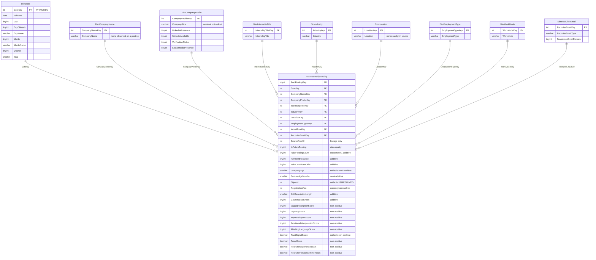

# Star Schema v1 — Internship Posting and Internship-Scam Analysis

| Item | Value |
| --- | --- |
| Document | Dimensional model design, **Star Schema v1** |
| Project | `internship-scam-dw` |
| Staging source | `data/staging/internship_postings_staging.csv` |
| Staging sha256 (before) | `e86ab0983fa456d24e0a8403e2af7cb4d19adf69fc7995f641af9d85b7adefa3` |
| Staging sha256 (after) | `e86ab0983fa456d24e0a8403e2af7cb4d19adf69fc7995f641af9d85b7adefa3` |
| Staging file unchanged | **YES** |
| Rows × columns in staging | 1,000,000 × 35 |
| Reference date | **2026-09-23** |
| Evidence base | `docs/data_dictionary.md`, `docs/cleaning_rules.md`, `results/profiling/`, `results/audit/`, `results/staging/`, `results/dimensional_audit/` |
| Companion document | [star_schema_design_vi.md](star_schema_design_vi.md) |
| Status | **Design proposal.** No SQL Server object was created. No ETL was implemented. No raw or staging data was modified. |

**Scope of this document.** This is a modelling artifact only. It proposes a grain, a fact table, a set of candidate dimensions, a measure catalogue and a source-to-target mapping. It does **not** create tables, does **not** load data and does **not** change any file under `data/`.

**Evidence rule.** Every number below is taken from the profiling, audit, staging or dimensional-audit outputs listed above, or was re-measured directly against the staging CSV in read-only mode on 2026-09-23. Where the source does not establish a meaning, this document records the gap rather than inventing one.

---

## 1. Business process

The analytical subject is **internship posting and internship-scam analysis**.

Stated conservatively, the process is this: a dataset of internship posting **records** has been collected, each record carrying descriptive attributes (title, industry, location, employment arrangement, company name and company-presence indicators), content-quality and risk signals (scores, counts, flags) and a label stating whether the record is considered a fake posting. The warehouse exists so that the distribution of that label, and of the risk signals that accompany it, can be sliced by time, role, industry, location, work arrangement, company profile and recruiter email type.

**What the business process is not.** Four claims are deliberately not made:

1. **Not verified real-world postings.** The dataset is an extract of records. Nothing in it establishes that a record corresponds to a real advertisement that was really published.
2. **Not unique postings.** No natural posting identifier exists, and no tested composite key was fully unique (§3). Two records may describe the same real posting.
3. **Not company entities.** `company_name` is a string observed on a record, not a company identifier (§5.2, §6).
4. **Not a ground-truth fraud judgement.** `is_fake_posting` is a **label carried by the source**. This design treats it as the outcome to be analysed, not as established fact about the world.

These four restraints shape every decision that follows.

---

## 2. Final grain

> **Each row in `FactInternshipPosting` represents one observed internship posting record from the source dataset.**

This is a **source-record / posting-record grain**. It is not a claim that each row is a distinct real-world posting. Five measured facts fix it there.

**2.1 There is no natural posting ID.** The 33 source columns contain no identifier of any kind — no posting ID, no company ID, no recruiter ID. The data dictionary states this explicitly.

**2.2 No tested composite key was fully unique.** Four composites were tested against all 1,000,000 rows:

| Candidate composite | Attributes | Distinct combinations | Duplicate rows | Duplicate % | Unique key? |
| --- | ---: | ---: | ---: | ---: | --- |
| `company_name` + `posting_date` | 2 | 990,918 | 9,082 | 0.9082 | **No** |
| + `internship_title` | 3 | 998,936 | 1,064 | 0.1064 | **No** |
| + `location` | 4 | 999,869 | 131 | 0.0131 | **No** |
| + `industry` + `employment_type` + `work_mode` | 7 | 999,999 | 1 | 0.0001 | **No** |

Even the seven-attribute composite leaves 1 duplicate row. The count falls steeply but never reaches zero, so no business key can be declared. Separately, there are **0 exact duplicate rows** on a full 34-attribute comparison (excluding `source_row_id`) — the rows are physically distinct, but not distinguishable by any *meaningful* subset of attributes.

**2.3 `source_row_id` is lineage only.** It runs 1..1,000,000, contiguous and distinct, and was created by the staging load. It identifies a **line in a file**, not a posting in the world. Promoting it to a business key would dress a file offset up as a business identity. It is therefore carried in the fact as a lineage attribute and is explicitly **not** the fact's primary key (§8.2).

**2.4 `FactPostingKey` is a DW surrogate key.** The fact's primary key is a warehouse-generated integer with no business meaning. It exists to give every fact row a stable handle for joins and reloads, and it makes no claim about the world.

**2.5 Therefore the grain is a record grain.** Any count produced by this schema — including `PostingCount` — counts **observed source records**. If a stakeholder asks "how many internships were advertised?", the honest answer from this warehouse is "we observed N records", and the gap between those two statements is a real limitation, not a rounding detail.

---

## 3. Schema overview

Star Schema v1 is a **pure star**: one fact table, nine dimensions, every dimension joined directly to the fact by a single integer surrogate key. No dimension joins to another dimension, and no snowflaking is introduced, because no measured functional dependency justifies one (§6.3).



The machine-readable diagram source is `docs/schema/star_schema.mmd`.

---

## 4. Dimension summary

| Dimension | Surrogate key | Source attribute(s) | Rows in v1 | SCD |
| --- | --- | --- | ---: | --- |
| `DimDate` | `DateKey` | `posting_date` | 3,288 (including Unknown) | Type 0 |
| `DimCompanyName` | `CompanyNameKey` | `company_name` | 535,938 | Type 1 |
| `DimCompanyProfile` | `CompanyProfileKey` | `company_size` + 4 presence/status flags | 64 | Mini-dimension, no history |
| `DimInternshipTitle` | `InternshipTitleKey` | `internship_title` | 9 | Type 1 |
| `DimIndustry` | `IndustryKey` | `industry` | 9 | Type 1 |
| `DimLocation` | `LocationKey` | `location` | 9 | Type 1 |
| `DimEmploymentType` | `EmploymentTypeKey` | `employment_type` | 4 | Type 1 |
| `DimWorkMode` | `WorkModeKey` | `work_mode` | 3 | Type 1 |
| `DimRecruiterEmail` | `RecruiterEmailKey` | `recruiter_email_type` + `suspicious_email_domain` | 2 | Type 0 |

Full detail, including evidence and caveats per dimension, is in `docs/schema/dimension_catalog.csv`.

---

## 5. Dimension designs

### 5.1 DimDate

| Column | Datatype | Null | Meaning |
| --- | --- | --- | --- |
| `DateKey` | `INT` | NO | Surrogate key, `YYYYMMDD` integer convention (e.g. 20260923) |
| `FullDate` | `DATE` | NO | The calendar date itself |
| `Day` | `TINYINT` | NO | Day of month, 1–31 |
| `DayOfWeek` | `TINYINT` | NO | Day of week as an integer, 1–7 |
| `DayName` | `VARCHAR(10)` | NO | Day name, e.g. `Monday` |
| `Month` | `TINYINT` | NO | Month number, 1–12 |
| `MonthName` | `VARCHAR(10)` | NO | Month name, e.g. `September` |
| `Quarter` | `TINYINT` | NO | Calendar quarter, 1–4 |
| `Year` | `SMALLINT` | NO | Calendar year |

**Why `YYYYMMDD`.** The evidence supports it and nothing suggests a better design. The integer form sorts chronologically, is human-readable in a query result, and is compact. It is adopted.

**Range and generation.** `DimDate` is generated from the calendar, not harvested from the data. Its normal analytical calendar covers **2018-01-01 to 2026-12-31** inclusive: **3,287** regular rows. A direct measurement against staging on 2026-09-23 confirmed that the observed dates number **3,287** and that **every calendar day in that range is present in the data**, so the generated calendar and the observed set coincide exactly. Including the Unknown member, `DimDate` contains **3,288** rows in total.

**Future dates are mandatory here.** 30,246 rows (3.0246%) fall after the 2026-09-23 reference date, across 99 distinct future dates ending at 2026-12-31. If the calendar stopped at the reference date those rows would lose their join. The calendar therefore runs to the end of 2026 (§16).

**SCD.** Type 0 / static. The calendar attributes of a given date do not change.

**Unknown member.** `DateKey = 0` with `FullDate = 1900-01-01` is reserved for referential integrity in future loads. `1900-01-01` is a technical sentinel for the Unknown member; it is not part of the normal analytical calendar, whose regular range is 2018-01-01 through 2026-12-31. `posting_date` is non-null on all 1,000,000 rows, so **0 fact rows reference the Unknown member in v1** — that is a load-time assertion, not an expectation.

### 5.2 DimCompanyName

| Column | Datatype | Null | Meaning |
| --- | --- | --- | --- |
| `CompanyNameKey` | `INT` | NO | Surrogate key |
| `CompanyName` | `VARCHAR(64)` | NO | The `company_name` string as observed on a posting |

**Semantics — read this before using the dimension.** This dimension represents **the company name observed on a posting**. It does **not** assert that two rows carrying the identical `company_name` string are the same real-world company. The data dictionary records that the names follow a `<Surname> <Suffix>` pattern; `Smith PLC` appearing on 1,248 records is a string that recurred, not a company that posted 1,248 times.

**Size.** 535,938 members over 1,000,000 fact rows — 53.5938% of the fact row count. 471,992 names (88.0684%) appear on exactly one row.

**A considered alternative: degenerate dimension.** Storing `company_name` directly in the fact as a degenerate dimension was weighed. It avoids a dimension whose cardinality is half the fact table. It was **not** adopted, for two reasons: a 64-character string on 1,000,000 fact rows costs more than a 4-byte key plus a 535,938-row lookup, and OLAP tools browse dimension attributes far more naturally than fact columns. The trade-off is recorded here because the cardinality is genuinely uncomfortable and a future revision may reverse it.

**No profile attributes are attached.** `company_size`, the four presence/status flags, `company_age` and `domain_age_months` are all excluded from this dimension. §6 gives the measurements.

**SCD.** Type 1 — an insert-only lookup of distinct strings. Deliberately **not** Type 2: SCD Type 2 versions the history of an entity identified by a stable business key, and there is no such key here. Applying Type 2 would manufacture a history for something that may not be a single thing.

### 5.3 DimCompanyProfile

| Column | Datatype | Null | Meaning |
| --- | --- | --- | --- |
| `CompanyProfileKey` | `INT` | NO | Surrogate key |
| `CompanySize` | `VARCHAR(16)` | NO | `Startup` / `Small` / `Medium` / `Enterprise` — **nominal** |
| `LinkedInPresence` | `TINYINT` | NO | 0/1 as observed on the posting |
| `WebsiteAvailable` | `TINYINT` | NO | 0/1 as observed on the posting |
| `VerificationStatus` | `TINYINT` | NO | 0/1 as observed on the posting |
| `SocialMediaPresence` | `TINYINT` | NO | 0/1 as observed on the posting |

**What it is.** A **mini-dimension** holding the distinct combinations of five company-profile attributes **as observed for a posting**. It is a snapshot of how a company presented on one record. It is not a company.

**Actual distinct combinations, measured from staging.** The theoretical maximum is 4 × 2 × 2 × 2 × 2 = **64**. Measured directly on 2026-09-23, **all 64 of 64 combinations occur**. The largest holds 107,190 rows (10.7190%); the smallest holds 369 rows. No combination is absent, so the mini-dimension is fully populated at 64 rows and will not grow on reload of this extract.

**Why a mini-dimension rather than company attributes.** Per-attribute stability among the 63,946 `company_name` values that appear on more than one row:

| Attribute | Repeated names with exactly 1 distinct value | % stable |
| --- | ---: | ---: |
| `company_size` | 9,782 | 15.2973 |
| `linkedin_presence` | 32,453 | 50.7506 |
| `website_available` | 36,943 | 57.7722 |
| `verification_status` | 25,362 | 39.6616 |
| `social_media_presence` | 28,599 | 44.7237 |

Not one attribute is stable even at the generous per-attribute test, and the strict combination test is far worse (§6.1). A 64-row mini-dimension sidesteps the question entirely: it describes the posting's observed profile and asserts nothing about a company.

**`CompanySize` is nominal — a binding constraint.** `Startup`, `Small`, `Medium` and `Enterprise` must **not** be given an ordinal sort key, a numeric rank, or any treatment implying a scale. `Startup` is a company-stage label, not a size band; placing it below `Small` on an axis would assert an ordering the source does not define. Reports may order the four labels for presentation, but no ordinal attribute is stored and no measure may be computed as if the labels were numbers.

**SCD.** None required. Each fact row points at the combination observed for that posting; when a later posting shows a different combination, that posting simply points at a different one of the 64 rows. The change history lives in the fact table, by date, which is precisely the mini-dimension pattern.

**Unknown member.** `CompanyProfileKey = 0` is reserved for referential integrity. All five source columns are 0% missing, so **0 fact rows reference it in v1**.

### 5.4 DimInternshipTitle

| Column | Datatype | Null | Meaning |
| --- | --- | --- | --- |
| `InternshipTitleKey` | `INT` | NO | Surrogate key |
| `InternshipTitle` | `VARCHAR(32)` | NO | The role advertised |

9 rows, 0% missing, shares from 11.0502% to 11.1577%. SCD Type 1. `InternshipTitleKey = 0` reserved for Unknown; 0 references expected in v1.

`Industry` is **not** folded in. See §5.5.

### 5.5 DimIndustry

| Column | Datatype | Null | Meaning |
| --- | --- | --- | --- |
| `IndustryKey` | `INT` | NO | Surrogate key |
| `Industry` | `VARCHAR(24)` | NO | Industry label |

9 rows, 0% missing, shares from 11.0532% to 11.1803%. SCD Type 1. `IndustryKey = 0` reserved for Unknown; 0 references expected in v1.

**Why it is a separate dimension.** The intuition that a job title belongs to an industry is not supported here. All **81 of 81** `internship_title` × `industry` cells are populated, Cramér's V is **0.001236**, `internship_title` does not determine `industry` (9 industries per title) and `industry` does not determine `internship_title` (9 titles per industry). The two vary independently. Merging them would produce an 81-row cross-product dimension with no functional dependency to justify it, and would make it impossible to slice by industry without also slicing by title.

### 5.6 DimLocation

| Column | Datatype | Null | Meaning |
| --- | --- | --- | --- |
| `LocationKey` | `INT` | NO | Surrogate key |
| `Location` | `VARCHAR(24)` | NO | Location label as recorded |

9 rows, 0% missing, shares from 11.0559% to 11.1520%. SCD Type 1. `LocationKey = 0` reserved for Unknown; 0 references expected in v1.

**No hierarchy is inferred — a binding constraint.** No `Country`, `Region`, `CountryCode`, `Continent` or `Currency` attribute is added. The source contains none of them. It also does not state **what** the location locates: work location, company location or recruiter location are all consistent with the data. Deriving "Bangalore → India → INR" would import three facts the source does not carry, and the currency one would then be silently used to justify stipend conversion, which §12 forbids. If a geography reference is imported later it is an explicit, versioned decision — not an inference made here.

Observed fake-posting rate by location runs from 21.9166% (Toronto) to 22.5725% (Bangalore), against a 22.1958% overall baseline — a spread of 0.6559 percentage points.

### 5.7 DimEmploymentType

| Column | Datatype | Null | Meaning |
| --- | --- | --- | --- |
| `EmploymentTypeKey` | `INT` | NO | Surrogate key |
| `EmploymentType` | `VARCHAR(16)` | NO | Contractual arrangement |

4 rows: `Part-Time` 25.0700%, `Internship` 25.0000%, `Contract` 24.9669%, `Full-Time` 24.9633%. 0% missing. SCD Type 1. `EmploymentTypeKey = 0` reserved for Unknown; 0 references expected in v1.

That a dataset about internship postings contains `Full-Time`, `Part-Time` and `Contract` values is odd. It is recorded as a source-semantics question in §24, not repaired.

### 5.8 DimWorkMode

| Column | Datatype | Null | Meaning |
| --- | --- | --- | --- |
| `WorkModeKey` | `INT` | NO | Surrogate key |
| `WorkMode` | `VARCHAR(16)` | NO | Where the work happens |

3 rows: `Remote` 54.9339%, `Hybrid` 25.0526%, `Onsite` 20.0135%. 0% missing. SCD Type 1. `WorkModeKey = 0` reserved for Unknown; 0 references expected in v1.

**Why it is not merged with `DimEmploymentType`.** Low cardinality on both sides is not a reason to merge. All **12 of 12** combinations occur, with cell sizes from 4.9832% to 13.7624% of rows, and Cramér's V is **0.000000** — the two attributes are completely independent. A merged 12-row dimension would be a cross product, not a hierarchy, and it would force every query that wants one attribute to reason about both. They stay separate.

### 5.9 DimRecruiterEmail

| Column | Datatype | Null | Meaning |
| --- | --- | --- | --- |
| `RecruiterEmailKey` | `INT` | NO | Surrogate key |
| `RecruiterEmailType` | `VARCHAR(16)` | NO | `Corporate` or `Free` |
| `SuspiciousEmailDomain` | `TINYINT` | NO | 0 or 1 |

**The measured bijection.** The relationship is exact on all 1,000,000 rows:

| `recruiter_email_type` | `suspicious_email_domain` | Rows | % of rows |
| --- | ---: | ---: | ---: |
| `Corporate` | 0 | 749,433 | 74.9433 |
| `Corporate` | 1 | 0 | 0.0000 |
| `Free` | 0 | 0 | 0.0000 |
| `Free` | 1 | 250,567 | 25.0567 |

0 forward violations, 0 reverse violations, Cramér's V **1.000000**, only 2 of 4 possible cells populated. The two columns carry one attribute's worth of information.

**Why both are kept, in one dimension.** Three options were available. Dropping one column would discard source lineage for a redundancy measured on a single extract. Building two dimensions would create two join paths from the fact to the same information, inviting a query that groups by both and double-counts the reader's attention. Keeping both attributes in **one** two-row dimension preserves the source's own vocabulary — an analyst who thinks in `Corporate`/`Free` and an analyst who thinks in `0`/`1` both find their attribute — while there is exactly one key, one join and one grain. If a future extract breaks the bijection, this dimension simply grows to 3 or 4 members with **no schema change at all**, which is the decisive argument.

**SCD.** Type 0. A fixed two-member code list in this extract.

---

## 6. The rejected conventional DimCompany

A conventional company dimension of the form

```
DimCompany(CompanyName, CompanySize, CompanyAge, LinkedInPresence,
           WebsiteAvailable, DomainAgeMonths, VerificationStatus,
           SocialMediaPresence)
```

is **not created**. This is the most consequential rejection in the design, and it rests on measurement, not preference.

### 6.1 The combination test

A row in such a dimension asserts that `company_name` determines the whole combination of its attributes at once. That was tested directly:

| Metric | Value |
| --- | ---: |
| Distinct `company_name` values | 535,938 |
| Names appearing on more than one row | 63,946 (11.9316%) |
| Rows covered by repeated names | 528,008 (52.8008%) |
| Distinct combinations observed | 64 / 64 |
| **Repeated names with exactly one combination** | **1,672 / 63,946 (2.6147%)** |
| Repeated names with multiple combinations | 62,274 |
| Max combinations for one name | 61 |
| `company_name` → combination is a functional dependency | **No** |
| Rows inside violating groups | 524,627 (52.4627%) |

Among `company_name` values that appear more than once, **only 2.61% carry a single stable combination** of `company_size` plus the four presence/status indicators. Put the other way: for 97.39% of the names where the question can even be asked, the answer disagrees with itself. A `DimCompany` row would have to pick one combination and discard the rest, silently, for names covering 524,627 fact rows.

Single-row names are excluded from that percentage on purpose: they are stable by construction and would inflate it towards 100% while telling us nothing.

### 6.2 The age attributes vary over time, and not monotonically

`company_age` and `domain_age_months` are worse still. Sorting each `company_name`'s rows by `posting_date` and comparing consecutive postings:

| Attribute | Pairs examined | Increases | Unchanged | **Decreases** |
| --- | ---: | ---: | ---: | ---: |
| `company_age` | 458,854 | 225,123 (49.0620%) | 11,591 (2.5261%) | **222,140 (48.4119%)** |
| `domain_age_months` | 458,854 | — | — | **229,908 (49.5425%)** |

An age that runs backwards in roughly half of all consecutive observations is not a slowly changing attribute of an entity. Stability tells the same story: `company_age` is stable for 2.3942% of repeated names and `domain_age_months` for **0.1173%** — the least stable attribute in the entire dataset, taking up to 451 distinct values for a single name.

Both are therefore modelled as **fact measures at posting grain** (§8.3), not as dimension attributes.

### 6.3 What the evidence does and does not say

A low stability percentage does not prove the data is wrong. Two readings fit equally well: a single company genuinely changed its recorded attributes between postings, or rows sharing a `company_name` are simply different companies with the same name. **Nothing in this dataset settles which**, and nothing is corrected on the basis of it.

But both readings lead to the same modelling conclusion. If the names are different companies, a `DimCompany` keyed on the name is wrong because the key does not identify. If the names are one company whose attributes churn, a `DimCompany` is wrong because it would need SCD Type 2 — and Type 2 presupposes a stable business key, which is the very thing that is missing. There is no third reading in which the conventional dimension is correct.

The design therefore splits the company information along the line the evidence actually draws: the **name** (which is what was observed) goes to `DimCompanyName`; the **profile snapshot** (which is what was observed *on that record*) goes to `DimCompanyProfile`; and the two **numeric ages** (which behave as per-record numbers) go to the fact.

---

## 7. Dimension key strategy

**Every dimension uses an integer surrogate key**, generated by the warehouse, carrying no business meaning, and serving as the sole primary key of its table.

| Dimension | PK (surrogate) | Natural / source attribute(s) | Unknown member |
| --- | --- | --- | --- |
| `DimDate` | `DateKey` | `posting_date` | `DateKey = 0`, `FullDate = 1900-01-01` (technical sentinel) |
| `DimCompanyName` | `CompanyNameKey` | `company_name` | `0`, `CompanyName = 'Unknown'` |
| `DimCompanyProfile` | `CompanyProfileKey` | `company_size` + 4 flags (combination) | `0` |
| `DimInternshipTitle` | `InternshipTitleKey` | `internship_title` | `0`, `InternshipTitle = 'Unknown'` |
| `DimIndustry` | `IndustryKey` | `industry` | `0`, `Industry = 'Unknown'` |
| `DimLocation` | `LocationKey` | `location` | `0`, `Location = 'Unknown'` |
| `DimEmploymentType` | `EmploymentTypeKey` | `employment_type` | `0`, `EmploymentType = 'Unknown'` |
| `DimWorkMode` | `WorkModeKey` | `work_mode` | `0`, `WorkMode = 'Unknown'` |
| `DimRecruiterEmail` | `RecruiterEmailKey` | `recruiter_email_type` + `suspicious_email_domain` | `0` |

**The `DateKey` exception.** `DimDate` uses the `YYYYMMDD` integer form rather than a meaningless sequence. This is the one deliberate departure from "no business meaning in a surrogate key", it is the standard warehouse convention, and it is adopted because the evidence gives no reason to prefer a plain sequence.

**On the unknown member.** Key `0` is reserved in every dimension **for referential-integrity design only**. Every source column feeding a dimension has **0% missing values**, so no fact row will reference key 0 in v1. This is stated as a **load-time assertion**: the ETL should verify that the count of fact rows referencing key 0 is exactly 0, and fail loudly if it is not.

No unknown *source values* are manufactured. No `'Unknown'` string is ever written into a fact row's attributes, no missing measure is zero-filled, and the reserved row exists only so that a future extract containing a NULL has somewhere to land instead of breaking the load or silently dropping a record.

---

## 8. Fact table: `FactInternshipPosting`

### 8.1 Keys

| Column | Datatype | Null | Role |
| --- | --- | --- | --- |
| `FactPostingKey` | `BIGINT IDENTITY` | NO | **Primary key.** DW surrogate key, no business meaning |
| `DateKey` | `INT` | NO | FK → `DimDate` |
| `CompanyNameKey` | `INT` | NO | FK → `DimCompanyName` |
| `CompanyProfileKey` | `INT` | NO | FK → `DimCompanyProfile` |
| `InternshipTitleKey` | `INT` | NO | FK → `DimInternshipTitle` |
| `IndustryKey` | `INT` | NO | FK → `DimIndustry` |
| `LocationKey` | `INT` | NO | FK → `DimLocation` |
| `EmploymentTypeKey` | `INT` | NO | FK → `DimEmploymentType` |
| `WorkModeKey` | `INT` | NO | FK → `DimWorkMode` |
| `RecruiterEmailKey` | `INT` | NO | FK → `DimRecruiterEmail` |

Nine foreign keys, nine dimensions, one row per observed source record. Expected fact row count in v1: **1,000,000**.

### 8.2 Lineage attribute

| Column | Datatype | Null | Role |
| --- | --- | --- | --- |
| `SourceRowID` | `INT` | NO | Lineage handle back to the staging row |

`SourceRowID` is **not** the fact's primary business key and **not** its primary key. It is retained so that any fact row can be traced to the staging line it came from, which is what makes the load auditable. It should be indexed for that purpose. It identifies a line in a file; it does not identify a posting.

### 8.3 Data-quality attribute

| Column | Datatype | Null | Role |
| --- | --- | --- | --- |
| `IsFuturePosting` | `TINYINT` | NO | 1 if `posting_date` is after the 2026-09-23 reference date |

See §16.

### 8.4 Measures

All 18 physically stored measures, plus the 2 measures computed in the semantic layer, are catalogued in full in `docs/schema/measure_catalog.csv` and summarised in §9. Every one specifies source column, DW name, datatype, nullability, semantic meaning, default aggregation, additivity classification and caveats.

---

## 9. Measure catalogue

| DW measure | Source column | Datatype | Null | Default aggregation | Additivity |
| --- | --- | --- | --- | --- | --- |
| `PostingCount` | *(derived constant 1)* | `INT` | NO | `SUM` / `COUNT(*)` | Additive |
| `FakePostingCount` | `is_fake_posting` | `TINYINT` | NO | `SUM` | Additive |
| `FakePostingRate` | *(derived)* | `DECIMAL` | YES | ratio of sums | **Non-additive** |
| `CompanyAge` | `company_age` | `SMALLINT` | YES | `AVG` | Semi-additive |
| `DomainAgeMonths` | `domain_age_months` | `SMALLINT` | NO | `AVG` | Semi-additive |
| `Stipend` | `stipend` | `INT` | YES | **none — hidden by default** | **Unresolved** |
| `RegistrationFee` | `registration_fee` | `INT` | NO | `AVG` within one location | **Unresolved** |
| `JobDescriptionLength` | `job_description_length` | `SMALLINT` | NO | `AVG` | Additive |
| `GrammaticalErrors` | `grammatical_errors` | `TINYINT` | NO | `AVG` | Additive |
| `VagueDescriptionScore` | `vague_description_score` | `TINYINT` | NO | `AVG` | **Non-additive** |
| `UrgencyScore` | `urgency_score` | `TINYINT` | NO | `AVG` | **Non-additive** |
| `KeywordSpamScore` | `keyword_spam_score` | `TINYINT` | NO | `AVG` | **Non-additive** |
| `EmotionalManipulationScore` | `emotional_manipulation_score` | `TINYINT` | NO | `AVG` | **Non-additive** |
| `PhishingLanguageScore` | `phishing_language_score` | `TINYINT` | NO | `AVG` | **Non-additive** |
| `TrustSignalScore` | `trust_signal_score` | `DECIMAL(4,1)` | YES | `AVG` | **Non-additive** |
| `FraudScore` | `fraud_score` | `DECIMAL(4,1)` | NO | `AVG` | **Non-additive** |
| `RecruiterExperienceYears` | `recruiter_experience_years` | `DECIMAL(3,1)` | NO | `AVG` | **Non-additive** |
| `RecruiterResponseTimeHours` | `recruiter_response_time_hours` | `DECIMAL(3,1)` | NO | `AVG` | **Non-additive** |
| `FakeCertificateOffer` | `fake_certificate_offer` | `TINYINT` | NO | `SUM` | Additive |
| `PaymentRequired` | `payment_required` | `TINYINT` | NO | `SUM` | Additive |

**20 measures in total: 18 physically stored as fact columns, 2 calculated in the semantic layer.** `PostingCount` is not stored because `COUNT(*)` is exactly equivalent at this grain, and `FakePostingRate` must not be stored at all (§9.1). Full semantics and caveats per measure are in `docs/schema/measure_catalog.csv`.

### 9.1 Core count measures

**`PostingCount` = 1 per fact row.** Additive across every dimension. It is not physically stored: at this grain `COUNT(*)` is exactly equivalent and costs nothing. It counts **observed source records** (§2.5).

**`FakePostingCount` = `is_fake_posting`.** Source values remain `0`/`1` — no re-encoding. Additive: summing it counts records labelled fake. Measured basis: 221,958 rows carry 1 (22.1958%).

**`FakePostingRate`** is defined conceptually as:

```
FakePostingRate = SUM(FakePostingCount) / SUM(PostingCount)
```

It **must** be a calculated measure in the OLAP / semantic layer and must **never** be physically stored in the fact table. Storing a per-row ratio and then summing or averaging it produces an average of ratios, which is not the rate; it silently gives a posting on a one-record day the same weight as each posting on a thousand-record day. Computing it as a ratio of two sums re-weights correctly at every level of every hierarchy. Overall baseline: 22.1958%.

### 9.2 Score aggregation policy

These seven measures are classified **non-additive** and must **not** default to `SUM`:

`VagueDescriptionScore`, `UrgencyScore`, `KeywordSpamScore`, `EmotionalManipulationScore`, `PhishingLanguageScore`, `TrustSignalScore`, `FraudScore`.

**Recommended aggregations: `AVG`, `MIN`, `MAX`.**

**Why `SUM` is prohibited.** A bounded 0–100 score is not a quantity that accumulates. Adding two scores can exceed the scale's own maximum, so the result sits outside the domain the score is defined on and means nothing. `SUM(FraudScore)` for a location is not "the fraud of that location"; it is the fraud score multiplied by the posting count, which is a disguised row count. The semantic layer must not offer `SUM` on these measures at all — not as a non-default option, because a measure exposed is a measure that will be used.

Even `AVG` carries an assumption: the scoring rule behind each score is undocumented, so averaging assumes the scores are comparable across rows. That assumption is recorded, not resolved.

Two further cautions. `TrustSignalScore` has 10,000 missing rows (1.0%); `AVG` must exclude NULLs, never treat them as 0, or every aggregate is dragged towards zero by a full percent of the data. And `FraudScore` is close to, but **not** deterministic of, `is_fake_posting` — the two must never be treated as interchangeable.

### 9.3 Snapshot numeric attributes

`CompanyAge`, `DomainAgeMonths`, `RecruiterExperienceYears`, `RecruiterResponseTimeHours`, `JobDescriptionLength` and `GrammaticalErrors` are evaluated primarily with **`AVG`, `MIN`, `MAX`**, and do not default to `SUM`.

- `CompanyAge` and `DomainAgeMonths` are **stocks, not flows** — semi-additive. They may be averaged across any dimension but must never be summed over time. Summing "company age" across a month produces a number with no referent.
- `RecruiterExperienceYears` is a level attached to a person, and there is **no recruiter identifier** anywhere in the source, so a sum counts the same recruiter an unknown number of times.
- `RecruiterResponseTimeHours` is a per-posting duration: averages are meaningful, totals are not.
- `JobDescriptionLength` and `GrammaticalErrors` are genuinely **additive** — a total character count and a total error count are real quantities. They are listed here because `AVG` is nevertheless the more useful default, and `SUM` is offered only where a total is explicitly the question.

No `SUM` default is applied to any of the six unless a clear business interpretation is documented first.

---

## 10. Stipend — SEMANTICALLY UNRESOLVED

> **`Stipend` is marked SEMANTICALLY UNRESOLVED and is excluded from the default OLAP measure set.**

The source documents **neither the currency nor the pay period**. It is not stated whether a stipend is monthly, annual or a total for the internship, and it is not stated what currency any figure is in. The records span nine cities — Bangalore, Berlin, Dubai, London, New York, San Francisco, Singapore, Sydney, Toronto — which sit in different currency areas.

Measured basis: range 2,000 to 110,428, mean 35,066.1992, median 34,984.0, 73,830 distinct values, 10,000 rows (1.0%) missing.

**Rules, binding on Star Schema v1 and on anything built on it:**

- It **may** be physically stored in `FactInternshipPosting` as `INT NULL`, so the value is not lost. It is.
- **Do NOT convert currency.** No FX rate, no normalisation to a reference currency, no location-derived currency assumption.
- **Do NOT annualise.** No multiplication by 12, no division by any assumed period.
- **Do NOT define a cross-location average as a validated business metric.** `AVG(Stipend)` across locations adds an unknown number of unknown units and produces a figure that looks authoritative and means nothing.
- **Hide it from the default OLAP measure set** until the semantics are resolved. It should require a deliberate act to put on a report, and that report should carry the caveat.
- NULL stays NULL. The 10,000 missing rows are not zero-filled.

This is the single most dangerous field in the schema, precisely because it is numeric, plausible-looking and will aggregate without complaint.

## 11. RegistrationFee — currency unresolved

`RegistrationFee` is numeric and is a genuine quantity: it is the fee the posting asks the applicant to pay, and **0 is a real value meaning "no fee"**, not a placeholder for missing data. Measured basis: range 0 to 4,999, mean 252.083069, 4,951 distinct values, 900,095 rows (90.0095%) are exactly 0.

It **is** stored, but only under an explicit label as a **source numeric value**. The source currency is undocumented, so:

- Aggregation **within a single location** is defensible, with the caveat stated.
- **Cross-location monetary aggregation remains unresolved** and must not be published as a validated metric.
- No currency conversion is performed, for the same reason as §10.

It is less dangerous than `Stipend` only because 90.0095% of its values are 0, which makes a sum dominated by a minority of rows — but the unit problem is identical.

## 12. Payment redundancy

The audit proved the invariant on the whole extract:

```
payment_required == (registration_fee > 0)
```

| Check | Rows examined | Rows agreeing | Rows disagreeing | Flag 0 with positive fee | Flag 1 with zero fee | Invariant holds |
| --- | ---: | ---: | ---: | ---: | ---: | --- |
| `payment_required == (registration_fee > 0)` | 1,000,000 | 1,000,000 | 0 | 0 | 0 | **True** |

`payment_required` is therefore fully reproducible from `registration_fee` on this extract. Source lineage must not be silently discarded, so both alternatives are documented.

**Option A — store `PaymentRequired` in the fact for source fidelity.**
The fact carries the source's own 0/1 value, copied verbatim. The fact table remains self-describing: a reader sees the field the source actually provided, and no consumer needs to know a derivation rule to reproduce the source's meaning. Cost: one `TINYINT` on 1,000,000 rows, and a redundancy that must be kept honest.

**Option B — derive `PaymentRequired` in the semantic layer from `RegistrationFee`.**
The fact stores only `RegistrationFee`; the semantic layer exposes `PaymentRequired := RegistrationFee > 0`. The model carries no redundant column and the two fields cannot drift apart, because there is only one. Cost: the source's own field no longer exists anywhere in the warehouse, and the derivation rule — which is an *observation* about this extract, not a documented source rule — is promoted to a definition.

**Recommendation for Star Schema v1: Option A.**

The trade-off, stated plainly. Option B is more elegant and strictly normalises away a proven redundancy. It is not recommended because the redundancy is **measured on one extract, not guaranteed by the source**. Nothing in the source documentation states that `payment_required` is defined as `registration_fee > 0`; the audit observed that they agree. If a future extract carries a posting that requires a non-monetary payment, or a zero-fee posting that nonetheless demands payment, Option B would not record it — it would compute the wrong value and report it confidently. Option A stores what the source said, and the disagreement becomes visible instead of impossible.

Option A's weakness is real and must be managed: two columns that should agree can be loaded inconsistently. The mitigation is explicit in the mapping — **ETL must COPY `payment_required` verbatim and must never recompute it**, and the load must assert `payment_required == (registration_fee > 0)` as a data-quality check that raises on any disagreement. Under that discipline Option A costs one byte per row and buys the ability to detect a source change; Option B saves the byte and guarantees the change is never seen.

## 13. `unrealistic_salary_flag` — excluded from Star Schema v1

`unrealistic_salary_flag` is **constant 0** across all 1,000,000 rows: 1 distinct value, sum 0.

**Recommendation: exclude it from the analytical Star Schema v1.** It has zero analytical variance in this extract. As a dimension attribute it would produce a one-member dimension that cannot slice anything; as a measure, every aggregate of it is 0 by construction. It would add a column, an ETL step and a line in every data dictionary, in exchange for no information.

**This is an analytical-schema exclusion, NOT a source-data deletion.** The field remains present and unmodified in `data/raw/` and in `data/staging/`. Nothing is deleted anywhere. If a future extract carries variance in this field, it can be admitted to the fact table as an additive flag measure without any change to the grain, the dimensions or the existing measures — the exclusion costs nothing to reverse.

## 14. `IsFuturePosting` — a data-quality flag

`IsFuturePosting` is retained in the fact as a **data-quality / temporal flag**, not as a business measure.

30,246 rows (3.0246%) carry `posting_date` after the fixed reference date **2026-09-23**, spread over 99 distinct future dates ending at 2026-12-31.

**What it is for.** It lets an analyst filter those records out of a trend analysis, or isolate them for inspection, **without deleting them**. The alternative — dropping 30,246 records at load time — would destroy evidence about the source and silently change every total.

**What it is not.** It is not a business measure and must not be presented as one. `SUM(IsFuturePosting)` is a count of records with a data-quality condition, which is a useful diagnostic and not an analytical result. It does not belong on a fake-posting dashboard.

**It is fixed, not recomputed.** The flag was computed at staging against the fixed 2026-09-23 reference date and is copied verbatim. ETL must **not** recompute it against a moving "today", or the same record would change category over time and historical reports would stop reproducing.

`DimDate` must cover these dates (§5.1), or the 30,246 rows lose their join.

---

## 15. SCD strategy

| Dimension | SCD | Reasoning |
| --- | --- | --- |
| `DimDate` | **Type 0** (static) | Generated from the calendar. The attributes of a given date — its year, quarter, month, day name — cannot change. Nothing to track. |
| `DimInternshipTitle` | **Type 1** | A 9-member code list. If a label is corrected or renamed, the correct behaviour is to overwrite: the old spelling has no analytical value, and history restated under the new label is what an analyst wants. |
| `DimIndustry` | **Type 1** | Same reasoning, 9 members. |
| `DimLocation` | **Type 1** | Same reasoning, 9 members. If a geography hierarchy is ever imported (§5.6), this decision is revisited — an imported hierarchy that gets revised may justify Type 2. |
| `DimEmploymentType` | **Type 1** | Same reasoning, 4 members. |
| `DimWorkMode` | **Type 1** | Same reasoning, 3 members. |
| `DimRecruiterEmail` | **Type 0** | A fixed two-member list in this extract, derived from a bijection with 0 violations. There is no attribute that could change without the membership itself changing, and a new member is an insert, not a change. |
| `DimCompanyName` | **Type 1**, with entity-history semantics explicitly **not** applied | An insert-only lookup of distinct strings. **SCD Type 2 is rejected**: Type 2 versions the history of an entity identified by a stable business key, and this dimension has no such key. Applying Type 2 would open and close validity ranges for something that may be several different companies sharing a name, producing a history of an entity that may not exist. The evidence (§6) does not support entity-history semantics, so none are applied. |
| `DimCompanyProfile` | **Snapshot mini-dimension; no SCD history required** | Each fact row references the profile combination **observed for that posting**. When a later posting shows a different combination, that posting points at a different one of the 64 rows — the change is recorded in the fact table, keyed by date, which is exactly the mini-dimension pattern. There is no dimension row whose attributes need versioning, because a row *is* a combination, and combinations do not change. All 64 combinations are already present, so the dimension is closed under reload of this extract. |

---

## 16. Additivity matrix

Conservative by design: a measure is marked additive across a dimension only where a sum has a defensible business meaning.

| Measure | Source | Additive across Date? | Additive across Company? | Additive across Location? | Recommended aggregation | Reason |
| --- | --- | :---: | :---: | :---: | --- | --- |
| `PostingCount` | *(constant 1)* | **YES** | **YES** | **YES** | `SUM` / `COUNT(*)` | A count of records. Sums correctly across every dimension; the safest measure in the schema. |
| `FakePostingCount` | `is_fake_posting` | **YES** | **YES** | **YES** | `SUM` | Summing a 0/1 outcome counts the records where it is set. |
| `FakePostingRate` | *(derived)* | NO | NO | NO | `SUM(fake)/SUM(count)` | A ratio. Summing or averaging ratios re-weights records incorrectly; it must be recomputed from the two sums at every level. |
| `FakeCertificateOffer` | `fake_certificate_offer` | **YES** | **YES** | **YES** | `SUM` (`AVG` = incidence rate) | Additive in the narrow sense that the sum counts flagged records. |
| `PaymentRequired` | `payment_required` | **YES** | **YES** | **YES** | `SUM` (`AVG` = incidence rate) | Same narrow sense. Redundant with `RegistrationFee > 0` on this extract (§12). |
| `JobDescriptionLength` | `job_description_length` | **YES** | **YES** | **YES** | `AVG` (`SUM` defined) | A character count; a total over a set of postings is a real quantity. |
| `GrammaticalErrors` | `grammatical_errors` | **YES** | **YES** | **YES** | `AVG` (`SUM` defined) | A count of occurrences, so totals are meaningful. |
| `CompanyAge` | `company_age` | NO | NO | NO | `AVG`, `MIN`, `MAX` | A stock, not a flow. Semi-additive: averageable across any dimension, never summable over time. Decreases in 48.4119% of consecutive pairs within one name. |
| `DomainAgeMonths` | `domain_age_months` | NO | NO | NO | `AVG`, `MIN`, `MAX` | Same stock-not-flow reasoning. Decreases in 49.5425% of consecutive pairs; the least stable attribute measured at 0.1173%. |
| `RecruiterExperienceYears` | `recruiter_experience_years` | NO | NO | NO | `AVG`, `MIN`, `MAX` | A level attached to a person. No recruiter identifier exists, so a sum counts the same recruiter an unknown number of times. |
| `RecruiterResponseTimeHours` | `recruiter_response_time_hours` | NO | NO | NO | `AVG`, `MIN`, `MAX` | A per-posting duration; averages are meaningful, totals are not. |
| `VagueDescriptionScore` | `vague_description_score` | NO | NO | NO | `AVG`, `MIN`, `MAX` | Bounded 0–100 score; a sum can exceed the scale maximum and has no referent. |
| `UrgencyScore` | `urgency_score` | NO | NO | NO | `AVG`, `MIN`, `MAX` | Bounded 0–100 score; same reasoning. |
| `KeywordSpamScore` | `keyword_spam_score` | NO | NO | NO | `AVG`, `MIN`, `MAX` | Bounded 0–100 score; same reasoning. |
| `EmotionalManipulationScore` | `emotional_manipulation_score` | NO | NO | NO | `AVG`, `MIN`, `MAX` | Bounded 0–100 score; same reasoning. |
| `PhishingLanguageScore` | `phishing_language_score` | NO | NO | NO | `AVG`, `MIN`, `MAX` | Bounded 0–100 score; same reasoning. |
| `TrustSignalScore` | `trust_signal_score` | NO | NO | NO | `AVG`, `MIN`, `MAX` | Bounded composite; not reproducible from the four trust flags. `AVG` must exclude the 10,000 NULLs, never zero-fill them. |
| `FraudScore` | `fraud_score` | NO | NO | NO | `AVG`, `MIN`, `MAX` | Bounded composite; same reasoning. Not deterministic of `is_fake_posting`. |
| `RegistrationFee` | `registration_fee` | **Within one location only** | **Within one location only** | **NO** | `AVG` within a location | Structurally a money amount and the 0 values are real, but the currency is undocumented, so a cross-location sum adds different units. |
| `Stipend` | `stipend` | **UNRESOLVED** | **UNRESOLVED** | **NO — prohibited** | **none — hidden by default** | Neither currency nor pay period is documented, across nine cities in different currency areas. No aggregation is validated (§10). |

---

## 17. Source-to-target mapping

All **35** staging columns appear below, exactly once each. Fields intentionally excluded from Star Schema v1 are marked explicitly rather than omitted. The machine-readable version, with full transformation rules, is `docs/schema/source_to_target_mapping.csv`.

| # | Staging column | Disposition | Target table | Target column |
| ---: | --- | --- | --- | --- |
| 1 | `posting_date` | Derived (FK) | `FactInternshipPosting` | `DateKey` |
| 2 | `internship_title` | Direct (dimension attribute) | `DimInternshipTitle` | `InternshipTitle` |
| 3 | `employment_type` | Direct (dimension attribute) | `DimEmploymentType` | `EmploymentType` |
| 4 | `work_mode` | Direct (dimension attribute) | `DimWorkMode` | `WorkMode` |
| 5 | `industry` | Direct (dimension attribute) | `DimIndustry` | `Industry` |
| 6 | `location` | Direct (dimension attribute) | `DimLocation` | `Location` |
| 7 | `company_name` | Direct (dimension attribute) | `DimCompanyName` | `CompanyName` |
| 8 | `company_size` | Direct (mini-dimension attribute) | `DimCompanyProfile` | `CompanySize` |
| 9 | `company_age` | Direct (fact measure) | `FactInternshipPosting` | `CompanyAge` |
| 10 | `linkedin_presence` | Direct (mini-dimension attribute) | `DimCompanyProfile` | `LinkedInPresence` |
| 11 | `website_available` | Direct (mini-dimension attribute) | `DimCompanyProfile` | `WebsiteAvailable` |
| 12 | `domain_age_months` | Direct (fact measure) | `FactInternshipPosting` | `DomainAgeMonths` |
| 13 | `verification_status` | Direct (mini-dimension attribute) | `DimCompanyProfile` | `VerificationStatus` |
| 14 | `stipend` | Direct (fact measure, **SEMANTICALLY UNRESOLVED**) | `FactInternshipPosting` | `Stipend` |
| 15 | `unrealistic_salary_flag` | **EXCLUDED from Star Schema v1** | *(none)* | *(none)* |
| 16 | `payment_required` | Direct (fact measure) — **Option A, recommended** | `FactInternshipPosting` | `PaymentRequired` |
| 17 | `registration_fee` | Direct (fact measure, currency unresolved) | `FactInternshipPosting` | `RegistrationFee` |
| 18 | `job_description_length` | Direct (fact measure) | `FactInternshipPosting` | `JobDescriptionLength` |
| 19 | `grammatical_errors` | Direct (fact measure) | `FactInternshipPosting` | `GrammaticalErrors` |
| 20 | `vague_description_score` | Direct (fact measure) | `FactInternshipPosting` | `VagueDescriptionScore` |
| 21 | `urgency_score` | Direct (fact measure) | `FactInternshipPosting` | `UrgencyScore` |
| 22 | `keyword_spam_score` | Direct (fact measure) | `FactInternshipPosting` | `KeywordSpamScore` |
| 23 | `fake_certificate_offer` | Direct (fact measure) | `FactInternshipPosting` | `FakeCertificateOffer` |
| 24 | `recruiter_experience_years` | Direct (fact measure) | `FactInternshipPosting` | `RecruiterExperienceYears` |
| 25 | `recruiter_email_type` | Direct (dimension attribute) | `DimRecruiterEmail` | `RecruiterEmailType` |
| 26 | `suspicious_email_domain` | Direct (dimension attribute) | `DimRecruiterEmail` | `SuspiciousEmailDomain` |
| 27 | `recruiter_response_time_hours` | Direct (fact measure) | `FactInternshipPosting` | `RecruiterResponseTimeHours` |
| 28 | `social_media_presence` | Direct (mini-dimension attribute) | `DimCompanyProfile` | `SocialMediaPresence` |
| 29 | `emotional_manipulation_score` | Direct (fact measure) | `FactInternshipPosting` | `EmotionalManipulationScore` |
| 30 | `phishing_language_score` | Direct (fact measure) | `FactInternshipPosting` | `PhishingLanguageScore` |
| 31 | `trust_signal_score` | Direct (fact measure) | `FactInternshipPosting` | `TrustSignalScore` |
| 32 | `fraud_score` | Direct (fact measure) | `FactInternshipPosting` | `FraudScore` |
| 33 | `is_fake_posting` | Direct (fact measure — the analytical outcome) | `FactInternshipPosting` | `FakePostingCount` |
| 34 | `source_row_id` | Direct (lineage attribute) | `FactInternshipPosting` | `SourceRowID` |
| 35 | `is_future_posting` | Direct (data-quality flag) | `FactInternshipPosting` | `IsFuturePosting` |

**Transformation policy.** Every mapping marked *Direct* copies the staging value verbatim: no cleaning, no imputation, no re-scaling, no re-encoding, no trimming, no case-folding, no entity resolution. The staging layer already applied the approved cleaning rules; this layer adds none. The only genuinely *Derived* mapping is `posting_date → DateKey`, which converts a date to its `YYYYMMDD` integer key.

---

## 18. OLAP questions the schema answers

Each question below is answerable from the schema as designed, using only the joins shown in §3.

| # | Question | Dimensions used | Measures used |
| ---: | --- | --- | --- |
| 1 | Posting count by year and month | `DimDate` (`Year`, `Month`) | `PostingCount` |
| 2 | Fake posting rate by internship title | `DimInternshipTitle` | `FakePostingRate` |
| 3 | Fake posting rate by industry | `DimIndustry` | `FakePostingRate` |
| 4 | Fake posting rate by location | `DimLocation` | `FakePostingRate` |
| 5 | Fake posting rate by work mode | `DimWorkMode` | `FakePostingRate` |
| 6 | Fake posting rate by employment type | `DimEmploymentType` | `FakePostingRate` |
| 7 | Average fraud score by category | any of `DimIndustry` / `DimInternshipTitle` / `DimLocation` | `AVG(FraudScore)` |
| 8 | Average trust signal by company profile | `DimCompanyProfile` | `AVG(TrustSignalScore)` |
| 9 | Fake posting patterns by recruiter email type | `DimRecruiterEmail` | `FakePostingRate`, `PostingCount` |
| 10 | Temporal trends in fake postings | `DimDate` (`Year`, `Quarter`, `Month`) | `FakePostingRate`, `FakePostingCount` |

Illustrative SQL for question 2:

```sql
SELECT  t.InternshipTitle,
        SUM(CAST(f.FakePostingCount AS DECIMAL(18,4)))
            / COUNT(*)                       AS FakePostingRate,
        COUNT(*)                             AS PostingCount
FROM    FactInternshipPosting  f
JOIN    DimInternshipTitle     t ON t.InternshipTitleKey = f.InternshipTitleKey
WHERE   f.IsFuturePosting = 0          -- optional data-quality filter, §14
GROUP BY t.InternshipTitle
ORDER BY FakePostingRate DESC;
```

Note the ratio of sums (§9.1), and the optional `IsFuturePosting` filter that excludes the 30,246 future-dated records without deleting them.

**Deliberately not offered as a validated example: cross-location stipend aggregation.** A query of the form `SELECT Location, AVG(Stipend) ... GROUP BY Location` is syntactically valid against this schema and semantically meaningless, because the nine locations sit in different currency areas and neither the currency nor the pay period is documented (§10). It is excluded from the demonstration set for that reason, not because the schema cannot express it.

---

## 19. Verification

The checks below were executed programmatically against the generated artifacts. Results are reported in the run output accompanying this design.

1. Every staging field appears **exactly once** in the source-to-target mapping — all 35, no duplicates, no omissions.
2. No duplicate target primary keys are defined across the model.
3. Every fact foreign key points at an existing candidate dimension.
4. Every measure named in this document appears in `measure_catalog.csv`.
5. The English and Vietnamese documents contain the same numeric decisions.
6. No source or staging dataset was modified — verified by sha256 before and after.

---

## 20. FINALIZED DECISIONS

1. **Grain.** Each row in `FactInternshipPosting` represents one observed internship posting record from the source dataset. A record grain, not a claim of unique real-world posting identity.
2. **Fact primary key.** `FactPostingKey`, a warehouse-generated surrogate key. `SourceRowID` is lineage and is explicitly not the primary key.
3. **No conventional `DimCompany`.** Rejected on the measurement that only 2.6147% of repeated `company_name` values carry a single stable profile combination.
4. **`DimCompanyName`** is created, holding the company name **observed on a posting**, with no profile attributes attached and no claim of real-world company identity.
5. **`DimCompanyProfile`** is created as a 64-row mini-dimension. All 64 of 64 possible combinations occur. `CompanySize` is nominal; no ordinal ordering is imposed.
6. **`company_age` and `domain_age_months`** are fact measures at posting grain, not dimension attributes.
7. **Nine dimensions**, each with an integer surrogate key, each joined directly to the fact. Pure star, no snowflaking.
8. **`DimDate`** uses the `YYYYMMDD` integer convention. Its normal analytical calendar covers 2018-01-01 to 2026-12-31 (3,287 regular rows), including the 99 distinct future dates; with the key-0 Unknown sentinel row, it contains 3,288 rows in total.
9. **`DimIndustry` stays separate from `DimInternshipTitle`** (81/81 cells populated, Cramér's V 0.001236).
10. **`DimWorkMode` stays separate from `DimEmploymentType`** (12/12 combinations, Cramér's V 0.000000).
11. **`DimRecruiterEmail`** holds both `RecruiterEmailType` and `SuspiciousEmailDomain` in one two-row dimension, preserving the exact bijection without creating two join paths.
12. **No geographic hierarchy** is derived from `location`.
13. **`FakePostingRate`** is a calculated measure in the semantic layer, computed as `SUM(FakePostingCount) / SUM(PostingCount)`, never stored per row.
14. **Seven score measures are non-additive** and must not default to, or be offered as, `SUM`.
15. **`Stipend` is SEMANTICALLY UNRESOLVED**: stored, not converted, not annualised, hidden from the default measure set, and never aggregated across locations as a validated metric.
16. **`RegistrationFee`** is stored only as a labelled source numeric value; cross-location monetary aggregation remains unresolved.
17. **`PaymentRequired`: Option A.** Stored in the fact for source fidelity, copied verbatim, with a load-time assertion of the invariant.
18. **`unrealistic_salary_flag` is excluded** from Star Schema v1 for zero analytical variance. An analytical-schema exclusion, not a source-data deletion; it remains in raw and staging.
19. **`IsFuturePosting` is retained** as a data-quality flag, fixed against 2026-09-23, never recomputed, and not treated as a business measure.
20. **SCD strategies** are as set out in §15, with SCD Type 2 explicitly rejected for `DimCompanyName`.
21. **Key 0 is reserved** for an Unknown member in every dimension, for referential-integrity design only, with an expected 0 fact references in v1.

## 21. DEFERRED DECISIONS

1. **Stipend currency.** Undocumented. Records span nine cities in different currency areas. Until resolved, no currency conversion and no cross-location aggregation.
2. **Stipend pay period.** Undocumented — monthly, annual or total for the internship are all consistent with the data. Until resolved, no annualisation.
3. **`registration_fee` currency.** Undocumented. Cross-location monetary aggregation stays unresolved; within-location aggregation carries the caveat.
4. **Real-world identity semantics of `company_name`.** Whether identical strings denote the same company is unresolved and unresolvable from this source. It drives the rejection of `DimCompany` (§6) and the refusal of SCD Type 2 on `DimCompanyName` (§15). If an external company register is ever joined, the whole company sub-model is reopened.
5. **Whether future source releases provide a true posting ID.** If one appears, the grain statement in §2 can be strengthened from a record grain to a posting grain, `SourceRowID` may be demoted or retired, and duplicate-detection becomes possible. Until then the record grain stands.
6. **What `location` locates** — work, company or recruiter. Blocks any geography hierarchy (§5.6).
7. **The scoring rules behind the seven bounded scores.** Undocumented, so even `AVG` assumes cross-row comparability.
8. **Why `employment_type` contains `Full-Time`, `Part-Time` and `Contract`** in a dataset of internship postings. A source-semantics question, not a data defect.
9. **Whether `is_fake_posting` is ground truth or itself a model output.** Treated throughout as a source-provided label, not as established fact.

---

*Generated 2026-09-23. Vietnamese equivalent: [star_schema_design_vi.md](star_schema_design_vi.md).*
