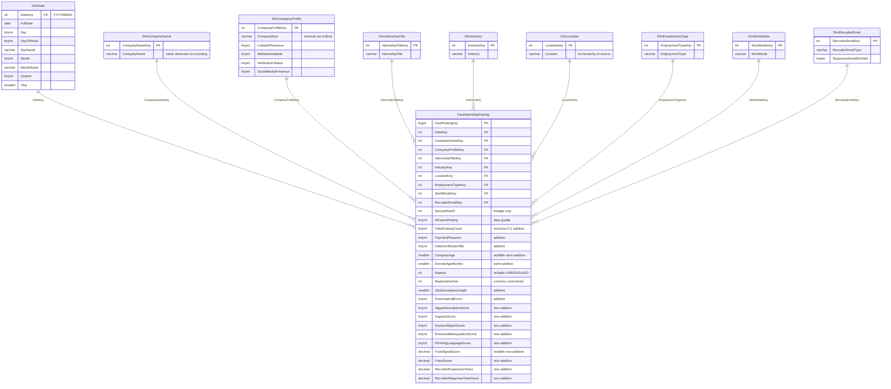

# Star Schema v1 — Phân tích tin tuyển thực tập và lừa đảo thực tập

| Mục | Giá trị |
| --- | --- |
| Tài liệu | Thiết kế mô hình dimensional, **Star Schema v1** |
| Dự án | `internship-scam-dw` |
| Nguồn staging | `data/staging/internship_postings_staging.csv` |
| sha256 staging (trước) | `e86ab0983fa456d24e0a8403e2af7cb4d19adf69fc7995f641af9d85b7adefa3` |
| sha256 staging (sau) | `e86ab0983fa456d24e0a8403e2af7cb4d19adf69fc7995f641af9d85b7adefa3` |
| Tệp staging không thay đổi | **CÓ** |
| Số dòng × cột trong staging | 1,000,000 × 35 |
| Ngày tham chiếu | **2026-09-23** |
| Cơ sở bằng chứng | `docs/data_dictionary.md`, `docs/cleaning_rules.md`, `results/profiling/`, `results/audit/`, `results/staging/`, `results/dimensional_audit/` |
| Tài liệu song hành | [star_schema_design_en.md](star_schema_design_en.md) |
| Trạng thái | **Đề xuất thiết kế.** Không tạo bất kỳ đối tượng SQL Server nào. Không triển khai ETL. Không sửa đổi dữ liệu raw hay staging. |

**Phạm vi tài liệu này.** Đây chỉ là một artifact mô hình hóa. Nó đề xuất một grain, một bảng Fact, một tập Dimension ứng viên, một danh mục measure và một source-to-target mapping. Nó **không** tạo bảng, **không** nạp dữ liệu và **không** thay đổi bất kỳ tệp nào trong `data/`.

**Nguyên tắc bằng chứng.** Mọi con số dưới đây đều lấy từ các kết quả profiling, audit, staging hoặc dimensional audit đã liệt kê ở trên, hoặc được đo lại trực tiếp trên tệp staging CSV ở chế độ chỉ đọc vào ngày 2026-09-23. Ở những chỗ nguồn không xác lập được ý nghĩa, tài liệu này ghi nhận khoảng trống đó thay vì tự bịa ra.

---

## 1. Business process

Chủ thể phân tích là **tin tuyển thực tập và phân tích lừa đảo thực tập**.

Phát biểu một cách dè dặt, quy trình như sau: một tập dữ liệu gồm các **bản ghi** tin tuyển thực tập đã được thu thập, mỗi bản ghi mang các thuộc tính mô tả (chức danh, ngành, địa điểm, hình thức làm việc, tên công ty và các chỉ báo hiện diện của công ty), các tín hiệu chất lượng nội dung và rủi ro (các điểm số, số đếm, cờ) và một nhãn cho biết bản ghi đó có được coi là tin giả hay không. Data Warehouse tồn tại để phân bố của nhãn đó, cùng các tín hiệu rủi ro đi kèm, có thể được cắt lát theo thời gian, vai trò, ngành, địa điểm, hình thức làm việc, company profile và loại email nhà tuyển dụng.

**Business process này KHÔNG phải là gì.** Bốn khẳng định được chủ ý không đưa ra:

1. **Không phải là tin đăng thực tế đã được kiểm chứng.** Bộ dữ liệu là một bản trích các bản ghi. Không có gì trong đó xác lập rằng một bản ghi tương ứng với một quảng cáo thật đã thực sự được đăng.
2. **Không phải là các tin đăng duy nhất.** Không tồn tại định danh tin đăng tự nhiên, và không một composite key nào được kiểm tra là duy nhất hoàn toàn (§3). Hai bản ghi có thể mô tả cùng một tin đăng thật.
3. **Không phải là các thực thể công ty.** `company_name` là một chuỗi được quan sát trên một bản ghi, không phải định danh công ty (§5.2, §6).
4. **Không phải là phán quyết gian lận đúng tuyệt đối.** `is_fake_posting` là một **nhãn do nguồn cung cấp**. Thiết kế này coi nó là kết quả cần phân tích, không phải sự thật đã được xác lập về thế giới.

Bốn giới hạn này định hình mọi quyết định tiếp theo.

---

## 2. Grain cuối cùng

> **Mỗi dòng trong `FactInternshipPosting` đại diện cho một bản ghi tin thực tập được quan sát trong bộ dữ liệu nguồn.**

Đây là một **grain ở mức bản ghi nguồn / bản ghi tin đăng**. Nó không khẳng định rằng mỗi dòng là một tin đăng thực tế riêng biệt. Năm sự kiện đã đo được cố định nó ở mức đó.

**2.1 Không có posting ID tự nhiên.** 33 cột nguồn không chứa định danh nào — không có posting ID, không có company ID, không có recruiter ID. Data dictionary nêu rõ điều này.

**2.2 Không composite key nào được kiểm tra là duy nhất hoàn toàn.** Bốn tổ hợp đã được kiểm tra trên toàn bộ 1,000,000 dòng:

| Composite ứng viên | Số thuộc tính | Số tổ hợp phân biệt | Dòng trùng | % trùng | Là khóa duy nhất? |
| --- | ---: | ---: | ---: | ---: | --- |
| `company_name` + `posting_date` | 2 | 990,918 | 9,082 | 0.9082 | **Không** |
| + `internship_title` | 3 | 998,936 | 1,064 | 0.1064 | **Không** |
| + `location` | 4 | 999,869 | 131 | 0.0131 | **Không** |
| + `industry` + `employment_type` + `work_mode` | 7 | 999,999 | 1 | 0.0001 | **Không** |

Ngay cả composite bảy thuộc tính vẫn còn 1 dòng trùng. Con số giảm rất nhanh nhưng không bao giờ về 0, nên không thể tuyên bố một business key nào. Riêng biệt, có **0 dòng trùng hoàn toàn** khi so sánh đầy đủ 34 thuộc tính (loại trừ `source_row_id`) — các dòng khác nhau về mặt vật lý, nhưng không phân biệt được bằng bất kỳ tập con thuộc tính *có ý nghĩa* nào.

**2.3 `source_row_id` chỉ là data lineage.** Nó chạy từ 1..1,000,000, liên tục và phân biệt, và được tạo ra bởi bước nạp staging. Nó định danh một **dòng trong một tệp**, không phải một tin đăng trong thế giới thực. Nâng nó thành business key sẽ là khoác cho một vị trí dòng trong tệp cái áo của một danh tính nghiệp vụ. Vì vậy nó được mang vào Fact như một thuộc tính lineage và dứt khoát **không** phải primary key của Fact (§8.2).

**2.4 `FactPostingKey` là surrogate key của DW.** Primary key của Fact là một số nguyên do warehouse sinh ra, không mang ý nghĩa nghiệp vụ. Nó tồn tại để mỗi dòng Fact có một handle ổn định cho việc join và nạp lại, và nó không khẳng định điều gì về thế giới.

**2.5 Do đó grain là grain bản ghi.** Bất kỳ phép đếm nào do schema này tạo ra — kể cả `PostingCount` — đều đếm **các bản ghi nguồn được quan sát**. Nếu một bên liên quan hỏi "có bao nhiêu vị trí thực tập đã được đăng tuyển?", câu trả lời trung thực từ warehouse này là "chúng ta quan sát được N bản ghi", và khoảng cách giữa hai phát biểu đó là một giới hạn thật sự, không phải chi tiết làm tròn.

---

## 3. Tổng quan schema

Star Schema v1 là một **star thuần túy**: một bảng Fact, chín Dimension, mỗi Dimension nối trực tiếp với Fact bằng một surrogate key số nguyên duy nhất. Không Dimension nào nối với Dimension khác, và không đưa vào snowflake, bởi không có functional dependency đo được nào biện minh cho điều đó (§6.3).



Mã nguồn sơ đồ ở dạng máy đọc được nằm tại `docs/schema/star_schema.mmd`.

---

## 4. Tóm tắt các Dimension

| Dimension | Surrogate key | Thuộc tính nguồn | Số dòng trong v1 | SCD |
| --- | --- | --- | ---: | --- |
| `DimDate` | `DateKey` | `posting_date` | 3,287 | Type 0 |
| `DimCompanyName` | `CompanyNameKey` | `company_name` | 535,938 | Type 1 |
| `DimCompanyProfile` | `CompanyProfileKey` | `company_size` + 4 cờ hiện diện/xác minh | 64 | Mini-dimension, không lưu lịch sử |
| `DimInternshipTitle` | `InternshipTitleKey` | `internship_title` | 9 | Type 1 |
| `DimIndustry` | `IndustryKey` | `industry` | 9 | Type 1 |
| `DimLocation` | `LocationKey` | `location` | 9 | Type 1 |
| `DimEmploymentType` | `EmploymentTypeKey` | `employment_type` | 4 | Type 1 |
| `DimWorkMode` | `WorkModeKey` | `work_mode` | 3 | Type 1 |
| `DimRecruiterEmail` | `RecruiterEmailKey` | `recruiter_email_type` + `suspicious_email_domain` | 2 | Type 0 |

Chi tiết đầy đủ, bao gồm bằng chứng và cảnh báo cho từng Dimension, nằm trong `docs/schema/dimension_catalog.csv`.

---

## 5. Thiết kế từng Dimension

### 5.1 DimDate

| Cột | Kiểu dữ liệu | Null | Ý nghĩa |
| --- | --- | --- | --- |
| `DateKey` | `INT` | KHÔNG | Surrogate key, quy ước số nguyên `YYYYMMDD` (ví dụ 20260923) |
| `FullDate` | `DATE` | KHÔNG | Chính ngày lịch đó |
| `Day` | `TINYINT` | KHÔNG | Ngày trong tháng, 1–31 |
| `DayOfWeek` | `TINYINT` | KHÔNG | Thứ trong tuần dạng số nguyên, 1–7 |
| `DayName` | `VARCHAR(10)` | KHÔNG | Tên thứ, ví dụ `Monday` |
| `Month` | `TINYINT` | KHÔNG | Số tháng, 1–12 |
| `MonthName` | `VARCHAR(10)` | KHÔNG | Tên tháng, ví dụ `September` |
| `Quarter` | `TINYINT` | KHÔNG | Quý theo lịch, 1–4 |
| `Year` | `SMALLINT` | KHÔNG | Năm theo lịch |

**Vì sao chọn `YYYYMMDD`.** Bằng chứng ủng hộ nó và không có gì gợi ý một thiết kế tốt hơn. Dạng số nguyên sắp xếp đúng theo thời gian, dễ đọc trong kết quả truy vấn, và gọn. Nó được chọn.

**Phạm vi và cách sinh.** `DimDate` được sinh từ lịch, không thu hoạch từ dữ liệu, bao phủ **2018-01-01 đến 2026-12-31** bao gồm cả hai đầu: **3,287** dòng. Phép đo trực tiếp trên staging ngày 2026-09-23 xác nhận rằng số ngày quan sát được là **3,287** và **mọi ngày lịch trong khoảng đó đều có mặt trong dữ liệu**, nên lịch được sinh ra và tập quan sát trùng khớp chính xác.

**Ngày tương lai là bắt buộc ở đây.** 30,246 dòng (3.0246%) rơi sau ngày tham chiếu 2026-09-23, trải trên 99 ngày tương lai phân biệt kết thúc ở 2026-12-31. Nếu lịch dừng ở ngày tham chiếu thì những dòng đó sẽ mất join. Vì vậy lịch chạy tới hết năm 2026 (§16).

**SCD.** Type 0 / tĩnh. Các thuộc tính lịch của một ngày cho trước không thay đổi.

**Unknown member.** `DateKey = 0` với `FullDate` NULL được dành riêng cho referential integrity trong các lần nạp tương lai. `posting_date` không null trên toàn bộ 1,000,000 dòng, nên **0 dòng Fact tham chiếu đến nó trong v1** — đó là một assertion lúc nạp, không phải một kỳ vọng.

### 5.2 DimCompanyName

| Cột | Kiểu dữ liệu | Null | Ý nghĩa |
| --- | --- | --- | --- |
| `CompanyNameKey` | `INT` | KHÔNG | Surrogate key |
| `CompanyName` | `VARCHAR(64)` | KHÔNG | Chuỗi `company_name` như được quan sát trên một tin đăng |

**Ngữ nghĩa — đọc phần này trước khi dùng Dimension.** Dimension này đại diện cho **tên công ty được quan sát trên một tin đăng**. Nó **không** khẳng định rằng hai dòng mang cùng chuỗi `company_name` là cùng một công ty thực tế. Data dictionary ghi nhận rằng các tên tuân theo mẫu `<Họ> <Hậu tố>`; `Smith PLC` xuất hiện trên 1,248 bản ghi là một chuỗi lặp lại, không phải một công ty đã đăng 1,248 lần.

**Kích thước.** 535,938 phần tử trên 1,000,000 dòng Fact — bằng 53.5938% số dòng Fact. 471,992 tên (88.0684%) chỉ xuất hiện trên đúng một dòng.

**Một phương án đã cân nhắc: degenerate dimension.** Việc lưu `company_name` trực tiếp trong Fact dưới dạng degenerate dimension đã được cân nhắc. Nó tránh được một Dimension có cardinality bằng một nửa bảng Fact. Phương án này **không** được chọn, vì hai lý do: một chuỗi 64 ký tự trên 1,000,000 dòng Fact tốn kém hơn một khóa 4 byte cộng với một bảng tra cứu 535,938 dòng, và các công cụ OLAP duyệt thuộc tính Dimension tự nhiên hơn nhiều so với duyệt cột Fact. Đánh đổi này được ghi lại ở đây vì cardinality thực sự gây khó chịu và một bản sửa đổi trong tương lai có thể đảo ngược nó.

**Không gắn kèm thuộc tính profile nào.** `company_size`, bốn cờ hiện diện/xác minh, `company_age` và `domain_age_months` đều bị loại khỏi Dimension này. §6 đưa ra các phép đo.

**SCD.** Type 1 — một bảng tra cứu chỉ chèn thêm các chuỗi phân biệt. Chủ ý **không** dùng Type 2: SCD Type 2 lưu phiên bản lịch sử của một thực thể được định danh bằng một business key ổn định, mà ở đây không có khóa như vậy. Áp dụng Type 2 sẽ chế tạo ra một lịch sử cho thứ có thể không phải là một thực thể duy nhất.

### 5.3 DimCompanyProfile

| Cột | Kiểu dữ liệu | Null | Ý nghĩa |
| --- | --- | --- | --- |
| `CompanyProfileKey` | `INT` | KHÔNG | Surrogate key |
| `CompanySize` | `VARCHAR(16)` | KHÔNG | `Startup` / `Small` / `Medium` / `Enterprise` — **nominal** |
| `LinkedInPresence` | `TINYINT` | KHÔNG | 0/1 như quan sát trên tin đăng |
| `WebsiteAvailable` | `TINYINT` | KHÔNG | 0/1 như quan sát trên tin đăng |
| `VerificationStatus` | `TINYINT` | KHÔNG | 0/1 như quan sát trên tin đăng |
| `SocialMediaPresence` | `TINYINT` | KHÔNG | 0/1 như quan sát trên tin đăng |

**Nó là gì.** Một **mini-dimension** chứa các tổ hợp phân biệt của năm thuộc tính company profile **như được quan sát cho một tin đăng**. Nó là một snapshot về cách một công ty thể hiện trên một bản ghi. Nó không phải là một công ty.

**Số tổ hợp phân biệt thực tế, đo từ staging.** Giá trị tối đa lý thuyết là 4 × 2 × 2 × 2 × 2 = **64**. Đo trực tiếp ngày 2026-09-23, **cả 64 trên 64 tổ hợp đều xuất hiện**. Tổ hợp lớn nhất chứa 107,190 dòng (10.7190%); tổ hợp nhỏ nhất chứa 369 dòng. Không tổ hợp nào vắng mặt, nên mini-dimension đầy đủ ở mức 64 dòng và sẽ không tăng thêm khi nạp lại bản trích này.

**Vì sao dùng mini-dimension thay vì thuộc tính công ty.** Độ ổn định theo từng thuộc tính trong số 63,946 giá trị `company_name` xuất hiện trên nhiều hơn một dòng:

| Thuộc tính | Tên lặp lại có đúng 1 giá trị phân biệt | % ổn định |
| --- | ---: | ---: |
| `company_size` | 9,782 | 15.2973 |
| `linkedin_presence` | 32,453 | 50.7506 |
| `website_available` | 36,943 | 57.7722 |
| `verification_status` | 25,362 | 39.6616 |
| `social_media_presence` | 28,599 | 44.7237 |

Không một thuộc tính nào ổn định ngay cả ở phép kiểm tra rộng rãi theo từng thuộc tính, và phép kiểm tra tổ hợp nghiêm ngặt còn tệ hơn nhiều (§6.1). Một mini-dimension 64 dòng né hẳn câu hỏi này: nó mô tả profile được quan sát của tin đăng và không khẳng định gì về một công ty.

**`CompanySize` là nominal — một ràng buộc bắt buộc.** `Startup`, `Small`, `Medium` và `Enterprise` **không được** gán khóa sắp xếp thứ tự, thứ hạng số, hay bất kỳ cách xử lý nào hàm ý một thang đo. `Startup` là nhãn giai đoạn của công ty, không phải một dải quy mô; đặt nó dưới `Small` trên một trục sẽ khẳng định một thứ tự mà nguồn không định nghĩa. Báo cáo có thể sắp xếp bốn nhãn để trình bày, nhưng không lưu thuộc tính thứ tự nào và không measure nào được tính như thể các nhãn là con số.

**SCD.** Không cần. Mỗi dòng Fact trỏ tới tổ hợp được quan sát cho tin đăng đó; khi một tin đăng sau này cho thấy tổ hợp khác, tin đăng đó chỉ đơn giản trỏ tới một trong 64 dòng khác. Lịch sử thay đổi nằm trong bảng Fact, theo ngày, và đó chính xác là mẫu hình mini-dimension.

**Unknown member.** `CompanyProfileKey = 0` được dành riêng cho referential integrity. Cả năm cột nguồn đều thiếu 0%, nên **0 dòng Fact tham chiếu đến nó trong v1**.

### 5.4 DimInternshipTitle

| Cột | Kiểu dữ liệu | Null | Ý nghĩa |
| --- | --- | --- | --- |
| `InternshipTitleKey` | `INT` | KHÔNG | Surrogate key |
| `InternshipTitle` | `VARCHAR(32)` | KHÔNG | Vai trò được đăng tuyển |

9 dòng, thiếu 0%, tỷ trọng từ 11.0502% đến 11.1577%. SCD Type 1. `InternshipTitleKey = 0` dành cho Unknown; kỳ vọng 0 tham chiếu trong v1.

`Industry` **không** được gộp vào. Xem §5.5.

### 5.5 DimIndustry

| Cột | Kiểu dữ liệu | Null | Ý nghĩa |
| --- | --- | --- | --- |
| `IndustryKey` | `INT` | KHÔNG | Surrogate key |
| `Industry` | `VARCHAR(24)` | KHÔNG | Nhãn ngành |

9 dòng, thiếu 0%, tỷ trọng từ 11.0532% đến 11.1803%. SCD Type 1. `IndustryKey = 0` dành cho Unknown; kỳ vọng 0 tham chiếu trong v1.

**Vì sao nó là một Dimension riêng.** Trực giác rằng một chức danh công việc thuộc về một ngành không được dữ liệu ở đây ủng hộ. Cả **81 trên 81** ô `internship_title` × `industry` đều có dữ liệu, Cramér's V là **0.001236**, `internship_title` không quyết định `industry` (9 ngành cho mỗi chức danh) và `industry` không quyết định `internship_title` (9 chức danh cho mỗi ngành). Hai biến thay đổi độc lập với nhau. Gộp chúng lại sẽ tạo ra một Dimension tích chéo 81 dòng mà không có functional dependency nào biện minh, và sẽ khiến không thể cắt lát theo ngành mà không đồng thời cắt lát theo chức danh.

### 5.6 DimLocation

| Cột | Kiểu dữ liệu | Null | Ý nghĩa |
| --- | --- | --- | --- |
| `LocationKey` | `INT` | KHÔNG | Surrogate key |
| `Location` | `VARCHAR(24)` | KHÔNG | Nhãn địa điểm như đã ghi nhận |

9 dòng, thiếu 0%, tỷ trọng từ 11.0559% đến 11.1520%. SCD Type 1. `LocationKey = 0` dành cho Unknown; kỳ vọng 0 tham chiếu trong v1.

**Không suy diễn phân cấp — một ràng buộc bắt buộc.** Không thêm thuộc tính `Country`, `Region`, `CountryCode`, `Continent` hay `Currency` nào. Nguồn không chứa bất kỳ thuộc tính nào trong số đó. Nguồn cũng không nêu địa điểm **định vị cái gì**: nơi làm việc, địa điểm công ty hay địa điểm nhà tuyển dụng đều nhất quán với dữ liệu. Suy ra "Bangalore → Ấn Độ → INR" sẽ nhập khẩu ba sự kiện mà nguồn không mang theo, và sự kiện về tiền tệ sau đó sẽ được âm thầm dùng để biện minh cho việc quy đổi stipend, điều mà §12 cấm. Nếu sau này nhập một bảng tham chiếu địa lý thì đó là một quyết định tường minh, có phiên bản — không phải một suy diễn được thực hiện ở đây.

Tỷ lệ tin giả quan sát được theo địa điểm chạy từ 21.9166% (Toronto) đến 22.5725% (Bangalore), so với mức nền chung 22.1958% — biên độ 0.6559 điểm phần trăm.

### 5.7 DimEmploymentType

| Cột | Kiểu dữ liệu | Null | Ý nghĩa |
| --- | --- | --- | --- |
| `EmploymentTypeKey` | `INT` | KHÔNG | Surrogate key |
| `EmploymentType` | `VARCHAR(16)` | KHÔNG | Hình thức hợp đồng |

4 dòng: `Part-Time` 25.0700%, `Internship` 25.0000%, `Contract` 24.9669%, `Full-Time` 24.9633%. Thiếu 0%. SCD Type 1. `EmploymentTypeKey = 0` dành cho Unknown; kỳ vọng 0 tham chiếu trong v1.

Việc một bộ dữ liệu về tin tuyển thực tập lại chứa các giá trị `Full-Time`, `Part-Time` và `Contract` là điều kỳ lạ. Nó được ghi nhận như một câu hỏi về ngữ nghĩa nguồn ở §24, không được sửa chữa.

### 5.8 DimWorkMode

| Cột | Kiểu dữ liệu | Null | Ý nghĩa |
| --- | --- | --- | --- |
| `WorkModeKey` | `INT` | KHÔNG | Surrogate key |
| `WorkMode` | `VARCHAR(16)` | KHÔNG | Nơi thực hiện công việc |

3 dòng: `Remote` 54.9339%, `Hybrid` 25.0526%, `Onsite` 20.0135%. Thiếu 0%. SCD Type 1. `WorkModeKey = 0` dành cho Unknown; kỳ vọng 0 tham chiếu trong v1.

**Vì sao không gộp với `DimEmploymentType`.** Cardinality thấp ở cả hai phía không phải là lý do để gộp. Cả **12 trên 12** tổ hợp đều xuất hiện, với kích thước ô từ 4.9832% đến 13.7624% số dòng, và Cramér's V là **0.000000** — hai thuộc tính hoàn toàn độc lập. Một Dimension gộp 12 dòng sẽ là một tích chéo, không phải một phân cấp, và nó buộc mọi truy vấn chỉ cần một thuộc tính phải suy nghĩ về cả hai. Chúng được giữ riêng.

### 5.9 DimRecruiterEmail

| Cột | Kiểu dữ liệu | Null | Ý nghĩa |
| --- | --- | --- | --- |
| `RecruiterEmailKey` | `INT` | KHÔNG | Surrogate key |
| `RecruiterEmailType` | `VARCHAR(16)` | KHÔNG | `Corporate` hoặc `Free` |
| `SuspiciousEmailDomain` | `TINYINT` | KHÔNG | 0 hoặc 1 |

**Song ánh đã đo được.** Quan hệ này đúng chính xác trên toàn bộ 1,000,000 dòng:

| `recruiter_email_type` | `suspicious_email_domain` | Số dòng | % số dòng |
| --- | ---: | ---: | ---: |
| `Corporate` | 0 | 749,433 | 74.9433 |
| `Corporate` | 1 | 0 | 0.0000 |
| `Free` | 0 | 0 | 0.0000 |
| `Free` | 1 | 250,567 | 25.0567 |

0 vi phạm chiều thuận, 0 vi phạm chiều nghịch, Cramér's V **1.000000**, chỉ 2 trong 4 ô khả dĩ có dữ liệu. Hai cột mang lượng thông tin của đúng một thuộc tính.

**Vì sao giữ cả hai, trong một Dimension.** Có ba lựa chọn. Bỏ một cột sẽ vứt đi data lineage của nguồn để đổi lấy một sự dư thừa chỉ đo được trên một bản trích duy nhất. Xây hai Dimension sẽ tạo hai đường join từ Fact tới cùng một thông tin, mời gọi một truy vấn nhóm theo cả hai và làm người đọc đếm trùng. Giữ cả hai thuộc tính trong **một** Dimension hai dòng bảo toàn đúng từ vựng của nguồn — người phân tích quen nghĩ theo `Corporate`/`Free` và người quen nghĩ theo `0`/`1` đều tìm thấy thuộc tính của mình — trong khi chỉ có đúng một khóa, một join và một grain. Nếu một bản trích tương lai phá vỡ song ánh, Dimension này chỉ đơn giản tăng lên 3 hoặc 4 phần tử mà **không cần thay đổi schema chút nào**, và đó là lập luận quyết định.

**SCD.** Type 0. Một danh mục mã cố định hai phần tử trong bản trích này.

---

## 6. `DimCompany` quy ước bị bác bỏ

Một Dimension công ty theo quy ước có dạng

```
DimCompany(CompanyName, CompanySize, CompanyAge, LinkedInPresence,
           WebsiteAvailable, DomainAgeMonths, VerificationStatus,
           SocialMediaPresence)
```

**không được tạo ra**. Đây là quyết định bác bỏ hệ trọng nhất trong thiết kế, và nó dựa trên phép đo, không phải sở thích.

### 6.1 Phép kiểm tra tổ hợp

Một dòng trong Dimension như vậy khẳng định rằng `company_name` quyết định toàn bộ tổ hợp các thuộc tính của nó cùng một lúc. Điều đó đã được kiểm tra trực tiếp:

| Chỉ số | Giá trị |
| --- | ---: |
| Số giá trị `company_name` phân biệt | 535,938 |
| Tên xuất hiện trên nhiều hơn một dòng | 63,946 (11.9316%) |
| Số dòng thuộc các tên lặp lại | 528,008 (52.8008%) |
| Số tổ hợp phân biệt quan sát được | 64 / 64 |
| **Tên lặp lại có đúng một tổ hợp** | **1,672 / 63,946 (2.6147%)** |
| Tên lặp lại có nhiều tổ hợp | 62,274 |
| Số tổ hợp tối đa cho một tên | 61 |
| `company_name` → tổ hợp là một functional dependency | **Không** |
| Số dòng nằm trong các nhóm vi phạm | 524,627 (52.4627%) |

Trong số các giá trị `company_name` xuất hiện nhiều hơn một lần, **chỉ 2.61% mang một tổ hợp ổn định duy nhất** của `company_size` cộng bốn chỉ báo hiện diện/xác minh. Nói cách khác: với 97.39% số tên mà câu hỏi này còn có thể đặt ra, câu trả lời tự mâu thuẫn với chính nó. Một dòng `DimCompany` sẽ phải chọn một tổ hợp và âm thầm vứt bỏ phần còn lại, cho những tên bao phủ 524,627 dòng Fact.

Các tên chỉ xuất hiện một dòng bị loại khỏi tỷ lệ đó một cách có chủ ý: chúng ổn định do cấu tạo và sẽ đẩy tỷ lệ lên gần 100% trong khi không cho ta biết điều gì.

### 6.2 Các thuộc tính tuổi biến thiên theo thời gian, và không đơn điệu

`company_age` và `domain_age_months` còn tệ hơn. Sắp xếp các dòng của mỗi `company_name` theo `posting_date` và so sánh các tin đăng liên tiếp:

| Thuộc tính | Số cặp khảo sát | Tăng | Không đổi | **Giảm** |
| --- | ---: | ---: | ---: | ---: |
| `company_age` | 458,854 | 225,123 (49.0620%) | 11,591 (2.5261%) | **222,140 (48.4119%)** |
| `domain_age_months` | 458,854 | — | — | **229,908 (49.5425%)** |

Một số tuổi chạy lùi trong khoảng một nửa tổng số quan sát liên tiếp thì không phải là một thuộc tính thay đổi chậm của một thực thể. Độ ổn định kể cùng một câu chuyện: `company_age` ổn định với 2.3942% số tên lặp lại và `domain_age_months` với **0.1173%** — thuộc tính kém ổn định nhất trong toàn bộ bộ dữ liệu, nhận tới 451 giá trị phân biệt cho một tên duy nhất.

Vì vậy cả hai được mô hình hóa thành **measure của Fact ở grain tin đăng** (§8.3), không phải thuộc tính Dimension.

### 6.3 Bằng chứng nói gì và không nói gì

Một tỷ lệ ổn định thấp không chứng minh rằng dữ liệu sai. Hai cách đọc đều phù hợp như nhau: một công ty duy nhất thực sự đã thay đổi các thuộc tính được ghi nhận giữa các lần đăng tin, hoặc các dòng cùng `company_name` đơn giản là những công ty khác nhau trùng tên. **Không có gì trong bộ dữ liệu này phân định được cách nào đúng**, và không có gì được sửa chữa dựa trên điều đó.

Nhưng cả hai cách đọc đều dẫn tới cùng một kết luận mô hình hóa. Nếu các tên là những công ty khác nhau, thì một `DimCompany` khóa theo tên là sai vì khóa không định danh được. Nếu các tên là một công ty duy nhất có thuộc tính biến động, thì `DimCompany` cũng sai vì nó sẽ cần SCD Type 2 — mà Type 2 giả định có một business key ổn định, chính là thứ đang thiếu. Không có cách đọc thứ ba nào mà Dimension quy ước là đúng.

Do đó thiết kế chia thông tin công ty theo đúng đường mà bằng chứng vạch ra: **tên** (thứ đã được quan sát) đi vào `DimCompanyName`; **snapshot profile** (thứ đã được quan sát *trên bản ghi đó*) đi vào `DimCompanyProfile`; và hai **số tuổi** (vốn hành xử như những con số theo từng bản ghi) đi vào Fact.

---

## 7. Chiến lược khóa Dimension

**Mọi Dimension đều dùng một surrogate key số nguyên**, do warehouse sinh ra, không mang ý nghĩa nghiệp vụ, và là primary key duy nhất của bảng đó.

| Dimension | PK (surrogate) | Thuộc tính natural key / nguồn | Unknown member |
| --- | --- | --- | --- |
| `DimDate` | `DateKey` | `posting_date` | `0`, `FullDate` NULL |
| `DimCompanyName` | `CompanyNameKey` | `company_name` | `0`, `CompanyName = 'Unknown'` |
| `DimCompanyProfile` | `CompanyProfileKey` | `company_size` + 4 cờ (tổ hợp) | `0` |
| `DimInternshipTitle` | `InternshipTitleKey` | `internship_title` | `0`, `InternshipTitle = 'Unknown'` |
| `DimIndustry` | `IndustryKey` | `industry` | `0`, `Industry = 'Unknown'` |
| `DimLocation` | `LocationKey` | `location` | `0`, `Location = 'Unknown'` |
| `DimEmploymentType` | `EmploymentTypeKey` | `employment_type` | `0`, `EmploymentType = 'Unknown'` |
| `DimWorkMode` | `WorkModeKey` | `work_mode` | `0`, `WorkMode = 'Unknown'` |
| `DimRecruiterEmail` | `RecruiterEmailKey` | `recruiter_email_type` + `suspicious_email_domain` | `0` |

**Ngoại lệ `DateKey`.** `DimDate` dùng dạng số nguyên `YYYYMMDD` thay vì một dãy số vô nghĩa. Đây là điểm đi chệch có chủ ý duy nhất khỏi nguyên tắc "surrogate key không mang ý nghĩa nghiệp vụ", nó là quy ước chuẩn của warehouse, và nó được chọn vì bằng chứng không cho lý do nào để ưu tiên một dãy số thuần túy.

**Về unknown member.** Khóa `0` được dành riêng trong mọi Dimension **chỉ phục vụ thiết kế referential integrity**. Mọi cột nguồn nuôi một Dimension đều có **0% giá trị thiếu**, nên sẽ không có dòng Fact nào tham chiếu khóa 0 trong v1. Điều này được phát biểu như một **assertion lúc nạp**: ETL phải kiểm chứng rằng số dòng Fact tham chiếu khóa 0 đúng bằng 0, và báo lỗi rõ ràng nếu không phải vậy.

Không chế tạo ra *giá trị nguồn* Unknown nào. Không bao giờ ghi chuỗi `'Unknown'` vào thuộc tính của một dòng Fact, không điền 0 cho measure bị thiếu, và dòng dành riêng đó chỉ tồn tại để một bản trích tương lai chứa NULL có chỗ đáp xuống thay vì làm hỏng quá trình nạp hoặc âm thầm làm rơi một bản ghi.

---

## 8. Bảng Fact: `FactInternshipPosting`

### 8.1 Các khóa

| Cột | Kiểu dữ liệu | Null | Vai trò |
| --- | --- | --- | --- |
| `FactPostingKey` | `BIGINT IDENTITY` | KHÔNG | **Primary key.** Surrogate key của DW, không mang ý nghĩa nghiệp vụ |
| `DateKey` | `INT` | KHÔNG | FK → `DimDate` |
| `CompanyNameKey` | `INT` | KHÔNG | FK → `DimCompanyName` |
| `CompanyProfileKey` | `INT` | KHÔNG | FK → `DimCompanyProfile` |
| `InternshipTitleKey` | `INT` | KHÔNG | FK → `DimInternshipTitle` |
| `IndustryKey` | `INT` | KHÔNG | FK → `DimIndustry` |
| `LocationKey` | `INT` | KHÔNG | FK → `DimLocation` |
| `EmploymentTypeKey` | `INT` | KHÔNG | FK → `DimEmploymentType` |
| `WorkModeKey` | `INT` | KHÔNG | FK → `DimWorkMode` |
| `RecruiterEmailKey` | `INT` | KHÔNG | FK → `DimRecruiterEmail` |

Chín foreign key, chín Dimension, một dòng cho mỗi bản ghi nguồn được quan sát. Số dòng Fact kỳ vọng trong v1: **1,000,000**.

### 8.2 Thuộc tính lineage

| Cột | Kiểu dữ liệu | Null | Vai trò |
| --- | --- | --- | --- |
| `SourceRowID` | `INT` | KHÔNG | Handle lineage trỏ ngược về dòng staging |

`SourceRowID` **không** phải primary business key của Fact và **không** phải primary key của nó. Nó được giữ lại để mọi dòng Fact có thể truy vết về dòng staging mà nó đến từ đó, và đó chính là thứ làm cho quá trình nạp có thể kiểm toán được. Nó nên được đánh index cho mục đích đó. Nó định danh một dòng trong một tệp; nó không định danh một tin đăng.

### 8.3 Thuộc tính chất lượng dữ liệu

| Cột | Kiểu dữ liệu | Null | Vai trò |
| --- | --- | --- | --- |
| `IsFuturePosting` | `TINYINT` | KHÔNG | 1 nếu `posting_date` nằm sau ngày tham chiếu 2026-09-23 |

Xem §16.

### 8.4 Các measure

Toàn bộ 18 measure được lưu vật lý, cộng với 2 measure tính trong semantic layer, được ghi đầy đủ trong `docs/schema/measure_catalog.csv` và tóm tắt ở §9. Mỗi measure đều nêu rõ cột nguồn, tên DW, kiểu dữ liệu, khả năng nullable, ý nghĩa ngữ nghĩa, phép tổng hợp mặc định, phân loại additivity và các cảnh báo.

---

## 9. Danh mục measure

| Measure DW | Cột nguồn | Kiểu dữ liệu | Null | Tổng hợp mặc định | Additivity |
| --- | --- | --- | --- | --- | --- |
| `PostingCount` | *(hằng số 1 dẫn xuất)* | `INT` | KHÔNG | `SUM` / `COUNT(*)` | Additive |
| `FakePostingCount` | `is_fake_posting` | `TINYINT` | KHÔNG | `SUM` | Additive |
| `FakePostingRate` | *(dẫn xuất)* | `DECIMAL` | CÓ | tỷ số của hai tổng | **Non-additive** |
| `CompanyAge` | `company_age` | `SMALLINT` | CÓ | `AVG` | Semi-additive |
| `DomainAgeMonths` | `domain_age_months` | `SMALLINT` | KHÔNG | `AVG` | Semi-additive |
| `Stipend` | `stipend` | `INT` | CÓ | **không — ẩn mặc định** | **Chưa xác định** |
| `RegistrationFee` | `registration_fee` | `INT` | KHÔNG | `AVG` trong cùng một địa điểm | **Chưa xác định** |
| `JobDescriptionLength` | `job_description_length` | `SMALLINT` | KHÔNG | `AVG` | Additive |
| `GrammaticalErrors` | `grammatical_errors` | `TINYINT` | KHÔNG | `AVG` | Additive |
| `VagueDescriptionScore` | `vague_description_score` | `TINYINT` | KHÔNG | `AVG` | **Non-additive** |
| `UrgencyScore` | `urgency_score` | `TINYINT` | KHÔNG | `AVG` | **Non-additive** |
| `KeywordSpamScore` | `keyword_spam_score` | `TINYINT` | KHÔNG | `AVG` | **Non-additive** |
| `EmotionalManipulationScore` | `emotional_manipulation_score` | `TINYINT` | KHÔNG | `AVG` | **Non-additive** |
| `PhishingLanguageScore` | `phishing_language_score` | `TINYINT` | KHÔNG | `AVG` | **Non-additive** |
| `TrustSignalScore` | `trust_signal_score` | `DECIMAL(4,1)` | CÓ | `AVG` | **Non-additive** |
| `FraudScore` | `fraud_score` | `DECIMAL(4,1)` | KHÔNG | `AVG` | **Non-additive** |
| `RecruiterExperienceYears` | `recruiter_experience_years` | `DECIMAL(3,1)` | KHÔNG | `AVG` | **Non-additive** |
| `RecruiterResponseTimeHours` | `recruiter_response_time_hours` | `DECIMAL(3,1)` | KHÔNG | `AVG` | **Non-additive** |
| `FakeCertificateOffer` | `fake_certificate_offer` | `TINYINT` | KHÔNG | `SUM` | Additive |
| `PaymentRequired` | `payment_required` | `TINYINT` | KHÔNG | `SUM` | Additive |

**Tổng cộng 20 measure: 18 được lưu vật lý dưới dạng cột Fact, 2 được tính trong semantic layer.** `PostingCount` không được lưu vì `COUNT(*)` tương đương chính xác ở grain này, và `FakePostingRate` tuyệt đối không được lưu (§9.1). Ngữ nghĩa và cảnh báo đầy đủ cho từng measure nằm trong `docs/schema/measure_catalog.csv`.

### 9.1 Các measure đếm cốt lõi

**`PostingCount` = 1 cho mỗi dòng Fact.** Additive trên mọi Dimension. Nó không được lưu vật lý: ở grain này `COUNT(*)` tương đương chính xác và không tốn gì. Nó đếm **các bản ghi nguồn được quan sát** (§2.5).

**`FakePostingCount` = `is_fake_posting`.** Giá trị nguồn giữ nguyên `0`/`1` — không mã hóa lại. Additive: cộng nó lại sẽ đếm số bản ghi được gán nhãn giả. Cơ sở đo lường: 221,958 dòng mang giá trị 1 (22.1958%).

**`FakePostingRate`** được định nghĩa về mặt khái niệm là:

```
FakePostingRate = SUM(FakePostingCount) / SUM(PostingCount)
```

Nó **bắt buộc** phải là một measure được tính trong OLAP / semantic layer và **tuyệt đối không** được lưu vật lý trong bảng Fact. Lưu một tỷ số theo từng dòng rồi cộng hoặc lấy trung bình sẽ tạo ra trung bình của các tỷ số, vốn không phải là tỷ lệ; nó âm thầm gán cho một tin đăng trong ngày chỉ có một bản ghi cùng trọng số với mỗi tin đăng trong ngày có một nghìn bản ghi. Tính nó như tỷ số của hai tổng sẽ gán lại trọng số đúng ở mọi cấp của mọi phân cấp. Mức nền chung: 22.1958%.

### 9.2 Chính sách tổng hợp cho các điểm số

Bảy measure sau được phân loại **non-additive** và **không được** mặc định dùng `SUM`:

`VagueDescriptionScore`, `UrgencyScore`, `KeywordSpamScore`, `EmotionalManipulationScore`, `PhishingLanguageScore`, `TrustSignalScore`, `FraudScore`.

**Phép tổng hợp khuyến nghị: `AVG`, `MIN`, `MAX`.**

**Vì sao cấm `SUM`.** Một điểm số giới hạn 0–100 không phải là đại lượng tích lũy được. Cộng hai điểm số có thể vượt quá giá trị lớn nhất của chính thang đo, nên kết quả nằm ngoài miền mà điểm số được định nghĩa và không có ý nghĩa gì. `SUM(FraudScore)` cho một địa điểm không phải là "mức gian lận của địa điểm đó"; nó là điểm gian lận nhân với số tin đăng, tức là một phép đếm dòng trá hình. Semantic layer tuyệt đối không được cung cấp `SUM` cho các measure này — kể cả như một tùy chọn không mặc định, bởi một measure đã bày ra là một measure sẽ được dùng.

Ngay cả `AVG` cũng kèm theo một giả định: quy tắc chấm điểm phía sau mỗi điểm số không được tài liệu hóa, nên việc lấy trung bình giả định các điểm số có thể so sánh được giữa các dòng. Giả định đó được ghi nhận, không được giải quyết.

Hai cảnh báo thêm. `TrustSignalScore` có 10,000 dòng thiếu (1.0%); `AVG` phải loại trừ NULL, tuyệt đối không coi chúng là 0, nếu không mọi giá trị tổng hợp sẽ bị kéo về 0 bởi trọn một phần trăm dữ liệu. Và `FraudScore` gần với, nhưng **không** quyết định tất định, `is_fake_posting` — hai thứ này tuyệt đối không được coi là thay thế cho nhau.

### 9.3 Các thuộc tính số dạng snapshot

`CompanyAge`, `DomainAgeMonths`, `RecruiterExperienceYears`, `RecruiterResponseTimeHours`, `JobDescriptionLength` và `GrammaticalErrors` được đánh giá chủ yếu bằng **`AVG`, `MIN`, `MAX`**, và không mặc định dùng `SUM`.

- `CompanyAge` và `DomainAgeMonths` là **stock, không phải flow** — semi-additive. Chúng có thể lấy trung bình trên mọi Dimension nhưng tuyệt đối không được cộng dồn theo thời gian. Cộng "tuổi công ty" qua một tháng tạo ra một con số không quy chiếu về đâu cả.
- `RecruiterExperienceYears` là một mức gắn với một con người, và trong nguồn **không có định danh nhà tuyển dụng** nào, nên một phép cộng sẽ đếm cùng một nhà tuyển dụng một số lần không xác định.
- `RecruiterResponseTimeHours` là khoảng thời gian theo từng tin đăng: giá trị trung bình có ý nghĩa, tổng thì không.
- `JobDescriptionLength` và `GrammaticalErrors` thực sự **additive** — tổng số ký tự và tổng số lỗi là những đại lượng có thật. Chúng được liệt kê ở đây vì `AVG` vẫn là mặc định hữu ích hơn, và `SUM` chỉ được cung cấp khi tổng đúng là câu hỏi đang đặt ra.

Không áp dụng `SUM` mặc định cho bất kỳ measure nào trong sáu measure trên trừ khi trước đó đã tài liệu hóa được một cách diễn giải nghiệp vụ rõ ràng.

---

## 10. Stipend — SEMANTICALLY UNRESOLVED

> **`Stipend` được đánh dấu SEMANTICALLY UNRESOLVED và bị loại khỏi tập measure OLAP mặc định.**

Nguồn **không tài liệu hóa cả đơn vị tiền tệ lẫn kỳ trả**. Không nêu rõ một khoản trợ cấp là theo tháng, theo năm hay là tổng cho cả kỳ thực tập, và không nêu rõ bất kỳ con số nào thuộc đơn vị tiền tệ nào. Các bản ghi trải trên chín thành phố — Bangalore, Berlin, Dubai, London, New York, San Francisco, Singapore, Sydney, Toronto — vốn nằm ở những khu vực tiền tệ khác nhau.

Cơ sở đo lường: khoảng giá trị từ 2,000 đến 110,428, trung bình 35,066.1992, trung vị 34,984.0, 73,830 giá trị phân biệt, 10,000 dòng (1.0%) bị thiếu.

**Các quy tắc, bắt buộc với Star Schema v1 và với mọi thứ xây trên nó:**

- Nó **có thể** được lưu vật lý trong `FactInternshipPosting` dưới dạng `INT NULL`, để giá trị không bị mất. Và nó được lưu.
- **KHÔNG quy đổi tiền tệ.** Không tỷ giá, không chuẩn hóa về một đồng tiền tham chiếu, không giả định tiền tệ suy ra từ địa điểm.
- **KHÔNG quy về năm.** Không nhân 12, không chia cho bất kỳ kỳ hạn giả định nào.
- **KHÔNG định nghĩa giá trị trung bình xuyên địa điểm như một chỉ số nghiệp vụ đã được kiểm chứng.** `AVG(Stipend)` qua các địa điểm cộng một số lượng không xác định các đơn vị không xác định và tạo ra một con số trông có vẻ đáng tin nhưng chẳng có nghĩa gì.
- **Ẩn nó khỏi tập measure OLAP mặc định** cho đến khi ngữ nghĩa được giải quyết. Việc đưa nó lên một báo cáo phải là một hành động có chủ ý, và báo cáo đó phải kèm theo cảnh báo.
- NULL vẫn là NULL. 10,000 dòng thiếu không được điền 0.

Đây là trường nguy hiểm nhất trong schema, chính vì nó là dạng số, trông hợp lý, và sẽ tổng hợp mà không phàn nàn gì.

## 11. RegistrationFee — đơn vị tiền tệ chưa xác định

`RegistrationFee` là dạng số và là một đại lượng thật sự: nó là khoản phí mà tin đăng yêu cầu ứng viên nộp, và **0 là một giá trị thật mang nghĩa "không có phí"**, không phải giá trị thay thế cho dữ liệu thiếu. Cơ sở đo lường: khoảng giá trị từ 0 đến 4,999, trung bình 252.083069, 4,951 giá trị phân biệt, 900,095 dòng (90.0095%) đúng bằng 0.

Nó **được** lưu, nhưng chỉ dưới nhãn tường minh là một **giá trị số của nguồn**. Đơn vị tiền tệ của nguồn không được tài liệu hóa, nên:

- Tổng hợp **trong cùng một địa điểm** là chấp nhận được, kèm theo cảnh báo đã nêu.
- **Tổng hợp tiền tệ xuyên địa điểm vẫn chưa được giải quyết** và không được công bố như một chỉ số đã kiểm chứng.
- Không thực hiện quy đổi tiền tệ, cùng lý do như §10.

Nó ít nguy hiểm hơn `Stipend` chỉ vì 90.0095% giá trị của nó bằng 0, khiến một phép tổng bị chi phối bởi một thiểu số các dòng — nhưng vấn đề đơn vị thì y hệt.

## 12. Dư thừa của payment

Audit đã chứng minh bất biến này trên toàn bộ bản trích:

```
payment_required == (registration_fee > 0)
```

| Phép kiểm tra | Số dòng khảo sát | Số dòng khớp | Số dòng lệch | Cờ 0 với phí dương | Cờ 1 với phí bằng 0 | Bất biến đúng |
| --- | ---: | ---: | ---: | ---: | ---: | --- |
| `payment_required == (registration_fee > 0)` | 1,000,000 | 1,000,000 | 0 | 0 | 0 | **Đúng** |

Do đó `payment_required` hoàn toàn tái tạo được từ `registration_fee` trên bản trích này. Không được âm thầm vứt bỏ data lineage của nguồn, nên cả hai phương án đều được tài liệu hóa.

**Phương án A — lưu `PaymentRequired` trong Fact để giữ độ trung thực với nguồn.**
Fact mang chính giá trị 0/1 của nguồn, sao chép nguyên văn. Bảng Fact vẫn tự mô tả được: người đọc thấy đúng trường mà nguồn thực sự cung cấp, và không consumer nào cần biết một quy tắc dẫn xuất để tái tạo ý nghĩa của nguồn. Chi phí: một `TINYINT` trên 1,000,000 dòng, và một sự dư thừa phải được giữ cho trung thực.

**Phương án B — dẫn xuất `PaymentRequired` trong semantic layer từ `RegistrationFee`.**
Fact chỉ lưu `RegistrationFee`; semantic layer phơi bày `PaymentRequired := RegistrationFee > 0`. Mô hình không mang cột dư thừa nào và hai trường không thể lệch nhau, vì chỉ có một trường. Chi phí: chính trường của nguồn không còn tồn tại ở bất kỳ đâu trong warehouse, và quy tắc dẫn xuất — vốn là một *quan sát* về bản trích này, không phải một quy tắc nguồn đã được tài liệu hóa — bị nâng lên thành một định nghĩa.

**Khuyến nghị cho Star Schema v1: Phương án A.**

Đánh đổi, nói thẳng. Phương án B thanh lịch hơn và chuẩn hóa triệt để một sự dư thừa đã được chứng minh. Nó không được khuyến nghị vì sự dư thừa đó được **đo trên một bản trích, không phải được nguồn bảo đảm**. Không có gì trong tài liệu nguồn nói rằng `payment_required` được định nghĩa là `registration_fee > 0`; audit chỉ quan sát thấy chúng khớp nhau. Nếu một bản trích tương lai mang một tin đăng yêu cầu một khoản thanh toán phi tiền tệ, hoặc một tin đăng phí bằng 0 nhưng vẫn đòi thanh toán, Phương án B sẽ không ghi nhận được — nó sẽ tính ra giá trị sai và báo cáo một cách tự tin. Phương án A lưu đúng điều nguồn đã nói, và sự bất đồng trở nên nhìn thấy được thay vì bất khả thi.

Điểm yếu của Phương án A là có thật và phải được quản lý: hai cột lẽ ra phải khớp nhau có thể bị nạp không nhất quán. Biện pháp giảm thiểu được nêu tường minh trong mapping — **ETL phải SAO CHÉP `payment_required` nguyên văn và tuyệt đối không được tính lại**, và quá trình nạp phải kiểm chứng `payment_required == (registration_fee > 0)` như một phép kiểm tra chất lượng dữ liệu, báo lỗi khi có bất kỳ sự bất đồng nào. Dưới kỷ luật đó, Phương án A tốn một byte mỗi dòng và mua được khả năng phát hiện một thay đổi ở nguồn; Phương án B tiết kiệm được byte đó và bảo đảm rằng thay đổi ấy không bao giờ được nhìn thấy.

## 13. `unrealistic_salary_flag` — loại khỏi Star Schema v1

`unrealistic_salary_flag` là **hằng số 0** trên toàn bộ 1,000,000 dòng: 1 giá trị phân biệt, tổng bằng 0.

**Khuyến nghị: loại nó khỏi Star Schema v1 phân tích.** Nó có phương sai phân tích bằng 0 trong bản trích này. Là thuộc tính Dimension, nó sẽ tạo ra một Dimension một phần tử không cắt lát được gì; là measure, mọi giá trị tổng hợp của nó đều bằng 0 do cấu tạo. Nó sẽ thêm một cột, một bước ETL và một dòng trong mọi data dictionary, để đổi lấy không thông tin nào.

**Đây là loại trừ ở mức schema phân tích, KHÔNG phải xóa dữ liệu nguồn.** Trường này vẫn hiện diện và không bị sửa đổi trong `data/raw/` và trong `data/staging/`. Không có gì bị xóa ở bất kỳ đâu. Nếu một bản trích tương lai mang phương sai ở trường này, nó có thể được nhận vào bảng Fact như một measure cờ additive mà không cần thay đổi grain, các Dimension hay các measure hiện có — việc đảo ngược quyết định loại trừ này không tốn gì cả.

## 14. `IsFuturePosting` — một cờ chất lượng dữ liệu

`IsFuturePosting` được giữ trong Fact như một **cờ chất lượng dữ liệu / cờ thời gian**, không phải một measure nghiệp vụ.

30,246 dòng (3.0246%) mang `posting_date` sau ngày tham chiếu cố định **2026-09-23**, trải trên 99 ngày tương lai phân biệt kết thúc ở 2026-12-31.

**Nó dùng để làm gì.** Nó cho phép người phân tích lọc những bản ghi đó ra khỏi một phân tích xu hướng, hoặc tách riêng chúng ra để kiểm tra, **mà không xóa chúng**. Phương án thay thế — loại bỏ 30,246 bản ghi lúc nạp — sẽ phá hủy bằng chứng về nguồn và âm thầm thay đổi mọi con số tổng.

**Nó không phải là gì.** Nó không phải một measure nghiệp vụ và không được trình bày như vậy. `SUM(IsFuturePosting)` là phép đếm số bản ghi có một điều kiện chất lượng dữ liệu, vốn là một chỉ báo chẩn đoán hữu ích chứ không phải một kết quả phân tích. Nó không thuộc về một dashboard về tin giả.

**Nó cố định, không tính lại.** Cờ này được tính ở staging so với ngày tham chiếu cố định 2026-09-23 và được sao chép nguyên văn. ETL **không được** tính lại nó so với một "hôm nay" trôi theo thời gian, nếu không cùng một bản ghi sẽ đổi phân loại theo thời gian và các báo cáo lịch sử sẽ không còn tái lập được.

`DimDate` phải bao phủ những ngày này (§5.1), nếu không 30,246 dòng sẽ mất join.

---

## 15. Chiến lược SCD

| Dimension | SCD | Lý do |
| --- | --- | --- |
| `DimDate` | **Type 0** (tĩnh) | Được sinh từ lịch. Các thuộc tính của một ngày cho trước — năm, quý, tháng, tên thứ — không thể thay đổi. Không có gì để theo dõi. |
| `DimInternshipTitle` | **Type 1** | Một danh mục mã 9 phần tử. Nếu một nhãn được sửa hoặc đổi tên, hành vi đúng là ghi đè: cách viết cũ không có giá trị phân tích, và lịch sử được trình bày lại theo nhãn mới chính là thứ người phân tích muốn. |
| `DimIndustry` | **Type 1** | Cùng lý do, 9 phần tử. |
| `DimLocation` | **Type 1** | Cùng lý do, 9 phần tử. Nếu sau này nhập một phân cấp địa lý (§5.6), quyết định này được xem xét lại — một phân cấp nhập vào mà bị chỉnh sửa có thể biện minh cho Type 2. |
| `DimEmploymentType` | **Type 1** | Cùng lý do, 4 phần tử. |
| `DimWorkMode` | **Type 1** | Cùng lý do, 3 phần tử. |
| `DimRecruiterEmail` | **Type 0** | Một danh mục cố định hai phần tử trong bản trích này, suy ra từ một song ánh với 0 vi phạm. Không có thuộc tính nào có thể thay đổi mà bản thân tập phần tử không thay đổi, và một phần tử mới là một phép chèn, không phải một thay đổi. |
| `DimCompanyName` | **Type 1**, và ngữ nghĩa lịch sử thực thể dứt khoát **không** được áp dụng | Một bảng tra cứu chỉ chèn thêm các chuỗi phân biệt. **SCD Type 2 bị bác bỏ**: Type 2 lưu phiên bản lịch sử của một thực thể được định danh bằng một business key ổn định, mà Dimension này không có khóa như vậy. Áp dụng Type 2 sẽ mở và đóng các khoảng hiệu lực cho thứ có thể là nhiều công ty khác nhau trùng tên, tạo ra lịch sử của một thực thể có thể không tồn tại. Bằng chứng (§6) không ủng hộ ngữ nghĩa lịch sử thực thể, nên không áp dụng ngữ nghĩa nào cả. |
| `DimCompanyProfile` | **Mini-dimension dạng snapshot; không cần lưu lịch sử SCD** | Mỗi dòng Fact tham chiếu tổ hợp profile **được quan sát cho tin đăng đó**. Khi một tin đăng sau này cho thấy tổ hợp khác, tin đăng đó trỏ tới một trong 64 dòng khác — thay đổi được ghi nhận trong bảng Fact, khóa theo ngày, và đó chính xác là mẫu hình mini-dimension. Không có dòng Dimension nào có thuộc tính cần lưu phiên bản, bởi một dòng *chính là* một tổ hợp, và các tổ hợp thì không thay đổi. Cả 64 tổ hợp đều đã hiện diện, nên Dimension này đóng kín khi nạp lại bản trích này. |

---

## 16. Ma trận additivity

Thận trọng theo thiết kế: một measure chỉ được đánh dấu additive trên một Dimension khi phép cộng có một ý nghĩa nghiệp vụ bảo vệ được.

| Measure | Nguồn | Additive theo Date? | Additive theo Company? | Additive theo Location? | Tổng hợp khuyến nghị | Lý do |
| --- | --- | :---: | :---: | :---: | --- | --- |
| `PostingCount` | *(hằng số 1)* | **CÓ** | **CÓ** | **CÓ** | `SUM` / `COUNT(*)` | Một phép đếm bản ghi. Cộng đúng trên mọi Dimension; là measure an toàn nhất trong schema. |
| `FakePostingCount` | `is_fake_posting` | **CÓ** | **CÓ** | **CÓ** | `SUM` | Cộng một kết quả 0/1 sẽ đếm số bản ghi có giá trị được bật. |
| `FakePostingRate` | *(dẫn xuất)* | KHÔNG | KHÔNG | KHÔNG | `SUM(fake)/SUM(count)` | Một tỷ số. Cộng hoặc lấy trung bình các tỷ số sẽ gán lại trọng số sai cho các bản ghi; nó phải được tính lại từ hai tổng ở mọi cấp. |
| `FakeCertificateOffer` | `fake_certificate_offer` | **CÓ** | **CÓ** | **CÓ** | `SUM` (`AVG` = tỷ lệ xuất hiện) | Additive theo nghĩa hẹp rằng phép cộng đếm số bản ghi bị gắn cờ. |
| `PaymentRequired` | `payment_required` | **CÓ** | **CÓ** | **CÓ** | `SUM` (`AVG` = tỷ lệ xuất hiện) | Cùng nghĩa hẹp đó. Dư thừa với `RegistrationFee > 0` trên bản trích này (§12). |
| `JobDescriptionLength` | `job_description_length` | **CÓ** | **CÓ** | **CÓ** | `AVG` (`SUM` có định nghĩa) | Một phép đếm ký tự; tổng trên một tập tin đăng là một đại lượng có thật. |
| `GrammaticalErrors` | `grammatical_errors` | **CÓ** | **CÓ** | **CÓ** | `AVG` (`SUM` có định nghĩa) | Một phép đếm số lần xuất hiện, nên tổng có ý nghĩa. |
| `CompanyAge` | `company_age` | KHÔNG | KHÔNG | KHÔNG | `AVG`, `MIN`, `MAX` | Là stock, không phải flow. Semi-additive: lấy trung bình được trên mọi Dimension, không bao giờ cộng được theo thời gian. Giảm trong 48.4119% các cặp liên tiếp trong cùng một tên. |
| `DomainAgeMonths` | `domain_age_months` | KHÔNG | KHÔNG | KHÔNG | `AVG`, `MIN`, `MAX` | Cùng lý do stock-không-phải-flow. Giảm trong 49.5425% các cặp liên tiếp; là thuộc tính kém ổn định nhất đo được, ở mức 0.1173%. |
| `RecruiterExperienceYears` | `recruiter_experience_years` | KHÔNG | KHÔNG | KHÔNG | `AVG`, `MIN`, `MAX` | Một mức gắn với một con người. Không tồn tại định danh nhà tuyển dụng, nên một phép cộng đếm cùng một nhà tuyển dụng một số lần không xác định. |
| `RecruiterResponseTimeHours` | `recruiter_response_time_hours` | KHÔNG | KHÔNG | KHÔNG | `AVG`, `MIN`, `MAX` | Khoảng thời gian theo từng tin đăng; trung bình có ý nghĩa, tổng thì không. |
| `VagueDescriptionScore` | `vague_description_score` | KHÔNG | KHÔNG | KHÔNG | `AVG`, `MIN`, `MAX` | Điểm số giới hạn 0–100; một phép cộng có thể vượt quá giá trị lớn nhất của thang đo và không quy chiếu về đâu. |
| `UrgencyScore` | `urgency_score` | KHÔNG | KHÔNG | KHÔNG | `AVG`, `MIN`, `MAX` | Điểm số giới hạn 0–100; cùng lý do. |
| `KeywordSpamScore` | `keyword_spam_score` | KHÔNG | KHÔNG | KHÔNG | `AVG`, `MIN`, `MAX` | Điểm số giới hạn 0–100; cùng lý do. |
| `EmotionalManipulationScore` | `emotional_manipulation_score` | KHÔNG | KHÔNG | KHÔNG | `AVG`, `MIN`, `MAX` | Điểm số giới hạn 0–100; cùng lý do. |
| `PhishingLanguageScore` | `phishing_language_score` | KHÔNG | KHÔNG | KHÔNG | `AVG`, `MIN`, `MAX` | Điểm số giới hạn 0–100; cùng lý do. |
| `TrustSignalScore` | `trust_signal_score` | KHÔNG | KHÔNG | KHÔNG | `AVG`, `MIN`, `MAX` | Điểm tổng hợp có giới hạn; không tái tạo được từ bốn cờ trust. `AVG` phải loại trừ 10,000 giá trị NULL, tuyệt đối không điền 0. |
| `FraudScore` | `fraud_score` | KHÔNG | KHÔNG | KHÔNG | `AVG`, `MIN`, `MAX` | Điểm tổng hợp có giới hạn; cùng lý do. Không quyết định tất định `is_fake_posting`. |
| `RegistrationFee` | `registration_fee` | **Chỉ trong cùng một địa điểm** | **Chỉ trong cùng một địa điểm** | **KHÔNG** | `AVG` trong một địa điểm | Về cấu trúc là một khoản tiền và các giá trị 0 là thật, nhưng đơn vị tiền tệ không được tài liệu hóa, nên một phép cộng xuyên địa điểm sẽ cộng các đơn vị khác nhau. |
| `Stipend` | `stipend` | **CHƯA XÁC ĐỊNH** | **CHƯA XÁC ĐỊNH** | **KHÔNG — bị cấm** | **không — ẩn mặc định** | Cả đơn vị tiền tệ lẫn kỳ trả đều không được tài liệu hóa, trên chín thành phố thuộc các khu vực tiền tệ khác nhau. Không phép tổng hợp nào được kiểm chứng (§10). |

---

## 17. Source-to-target mapping

Toàn bộ **35** cột staging đều xuất hiện dưới đây, mỗi cột đúng một lần. Các trường bị loại khỏi Star Schema v1 một cách có chủ ý được đánh dấu tường minh thay vì bỏ qua. Phiên bản máy đọc được, với đầy đủ quy tắc biến đổi, nằm tại `docs/schema/source_to_target_mapping.csv`.

| # | Cột staging | Cách xử lý | Bảng đích | Cột đích |
| ---: | --- | --- | --- | --- |
| 1 | `posting_date` | Derived (FK) | `FactInternshipPosting` | `DateKey` |
| 2 | `internship_title` | Direct (thuộc tính Dimension) | `DimInternshipTitle` | `InternshipTitle` |
| 3 | `employment_type` | Direct (thuộc tính Dimension) | `DimEmploymentType` | `EmploymentType` |
| 4 | `work_mode` | Direct (thuộc tính Dimension) | `DimWorkMode` | `WorkMode` |
| 5 | `industry` | Direct (thuộc tính Dimension) | `DimIndustry` | `Industry` |
| 6 | `location` | Direct (thuộc tính Dimension) | `DimLocation` | `Location` |
| 7 | `company_name` | Direct (thuộc tính Dimension) | `DimCompanyName` | `CompanyName` |
| 8 | `company_size` | Direct (thuộc tính mini-dimension) | `DimCompanyProfile` | `CompanySize` |
| 9 | `company_age` | Direct (measure của Fact) | `FactInternshipPosting` | `CompanyAge` |
| 10 | `linkedin_presence` | Direct (thuộc tính mini-dimension) | `DimCompanyProfile` | `LinkedInPresence` |
| 11 | `website_available` | Direct (thuộc tính mini-dimension) | `DimCompanyProfile` | `WebsiteAvailable` |
| 12 | `domain_age_months` | Direct (measure của Fact) | `FactInternshipPosting` | `DomainAgeMonths` |
| 13 | `verification_status` | Direct (thuộc tính mini-dimension) | `DimCompanyProfile` | `VerificationStatus` |
| 14 | `stipend` | Direct (measure của Fact, **SEMANTICALLY UNRESOLVED**) | `FactInternshipPosting` | `Stipend` |
| 15 | `unrealistic_salary_flag` | **LOẠI KHỎI Star Schema v1** | *(không có)* | *(không có)* |
| 16 | `payment_required` | Direct (measure của Fact) — **Phương án A, khuyến nghị** | `FactInternshipPosting` | `PaymentRequired` |
| 17 | `registration_fee` | Direct (measure của Fact, tiền tệ chưa xác định) | `FactInternshipPosting` | `RegistrationFee` |
| 18 | `job_description_length` | Direct (measure của Fact) | `FactInternshipPosting` | `JobDescriptionLength` |
| 19 | `grammatical_errors` | Direct (measure của Fact) | `FactInternshipPosting` | `GrammaticalErrors` |
| 20 | `vague_description_score` | Direct (measure của Fact) | `FactInternshipPosting` | `VagueDescriptionScore` |
| 21 | `urgency_score` | Direct (measure của Fact) | `FactInternshipPosting` | `UrgencyScore` |
| 22 | `keyword_spam_score` | Direct (measure của Fact) | `FactInternshipPosting` | `KeywordSpamScore` |
| 23 | `fake_certificate_offer` | Direct (measure của Fact) | `FactInternshipPosting` | `FakeCertificateOffer` |
| 24 | `recruiter_experience_years` | Direct (measure của Fact) | `FactInternshipPosting` | `RecruiterExperienceYears` |
| 25 | `recruiter_email_type` | Direct (thuộc tính Dimension) | `DimRecruiterEmail` | `RecruiterEmailType` |
| 26 | `suspicious_email_domain` | Direct (thuộc tính Dimension) | `DimRecruiterEmail` | `SuspiciousEmailDomain` |
| 27 | `recruiter_response_time_hours` | Direct (measure của Fact) | `FactInternshipPosting` | `RecruiterResponseTimeHours` |
| 28 | `social_media_presence` | Direct (thuộc tính mini-dimension) | `DimCompanyProfile` | `SocialMediaPresence` |
| 29 | `emotional_manipulation_score` | Direct (measure của Fact) | `FactInternshipPosting` | `EmotionalManipulationScore` |
| 30 | `phishing_language_score` | Direct (measure của Fact) | `FactInternshipPosting` | `PhishingLanguageScore` |
| 31 | `trust_signal_score` | Direct (measure của Fact) | `FactInternshipPosting` | `TrustSignalScore` |
| 32 | `fraud_score` | Direct (measure của Fact) | `FactInternshipPosting` | `FraudScore` |
| 33 | `is_fake_posting` | Direct (measure của Fact — kết quả phân tích) | `FactInternshipPosting` | `FakePostingCount` |
| 34 | `source_row_id` | Direct (thuộc tính lineage) | `FactInternshipPosting` | `SourceRowID` |
| 35 | `is_future_posting` | Direct (cờ chất lượng dữ liệu) | `FactInternshipPosting` | `IsFuturePosting` |

**Chính sách biến đổi.** Mọi mapping được đánh dấu *Direct* đều sao chép giá trị staging nguyên văn: không làm sạch, không điền khuyết, không đổi thang, không mã hóa lại, không cắt khoảng trắng, không chuẩn hóa hoa thường, không phân giải thực thể. Tầng staging đã áp dụng các cleaning rule đã được phê duyệt; tầng này không thêm quy tắc nào. Mapping *Derived* thực sự duy nhất là `posting_date → DateKey`, chuyển một ngày thành khóa số nguyên `YYYYMMDD` của nó.

---

## 18. Các câu hỏi OLAP mà schema trả lời được

Mỗi câu hỏi dưới đây đều trả lời được từ schema như đã thiết kế, chỉ dùng các join hiển thị ở §3.

| # | Câu hỏi | Dimension sử dụng | Measure sử dụng |
| ---: | --- | --- | --- |
| 1 | Số tin đăng theo năm và tháng | `DimDate` (`Year`, `Month`) | `PostingCount` |
| 2 | Tỷ lệ tin giả theo chức danh thực tập | `DimInternshipTitle` | `FakePostingRate` |
| 3 | Tỷ lệ tin giả theo ngành | `DimIndustry` | `FakePostingRate` |
| 4 | Tỷ lệ tin giả theo địa điểm | `DimLocation` | `FakePostingRate` |
| 5 | Tỷ lệ tin giả theo hình thức làm việc | `DimWorkMode` | `FakePostingRate` |
| 6 | Tỷ lệ tin giả theo loại hợp đồng | `DimEmploymentType` | `FakePostingRate` |
| 7 | Điểm gian lận trung bình theo danh mục | một trong `DimIndustry` / `DimInternshipTitle` / `DimLocation` | `AVG(FraudScore)` |
| 8 | Trust signal trung bình theo company profile | `DimCompanyProfile` | `AVG(TrustSignalScore)` |
| 9 | Mẫu hình tin giả theo loại email nhà tuyển dụng | `DimRecruiterEmail` | `FakePostingRate`, `PostingCount` |
| 10 | Xu hướng tin giả theo thời gian | `DimDate` (`Year`, `Quarter`, `Month`) | `FakePostingRate`, `FakePostingCount` |

SQL minh họa cho câu hỏi 2:

```sql
SELECT  t.InternshipTitle,
        SUM(CAST(f.FakePostingCount AS DECIMAL(18,4)))
            / COUNT(*)                       AS FakePostingRate,
        COUNT(*)                             AS PostingCount
FROM    FactInternshipPosting  f
JOIN    DimInternshipTitle     t ON t.InternshipTitleKey = f.InternshipTitleKey
WHERE   f.IsFuturePosting = 0          -- bộ lọc chất lượng dữ liệu tùy chọn, §14
GROUP BY t.InternshipTitle
ORDER BY FakePostingRate DESC;
```

Chú ý tỷ số của hai tổng (§9.1), và bộ lọc `IsFuturePosting` tùy chọn loại trừ 30,246 bản ghi có ngày tương lai mà không xóa chúng.

**Chủ ý không đưa ra như một ví dụ đã kiểm chứng: tổng hợp stipend xuyên địa điểm.** Một truy vấn dạng `SELECT Location, AVG(Stipend) ... GROUP BY Location` là hợp lệ về cú pháp trên schema này và vô nghĩa về ngữ nghĩa, bởi chín địa điểm nằm ở các khu vực tiền tệ khác nhau và cả đơn vị tiền tệ lẫn kỳ trả đều không được tài liệu hóa (§10). Nó bị loại khỏi tập ví dụ minh họa vì lý do đó, không phải vì schema không diễn đạt được nó.

---

## 19. Kiểm chứng

Các phép kiểm tra dưới đây đã được thực thi bằng chương trình trên các artifact được sinh ra. Kết quả được báo cáo trong đầu ra của lần chạy đi kèm thiết kế này.

1. Mọi trường staging xuất hiện **đúng một lần** trong source-to-target mapping — đủ 35, không trùng, không thiếu.
2. Không có primary key đích nào bị định nghĩa trùng trong toàn mô hình.
3. Mọi foreign key của Fact đều trỏ tới một Dimension ứng viên có tồn tại.
4. Mọi measure được nêu tên trong tài liệu này đều có mặt trong `measure_catalog.csv`.
5. Tài liệu tiếng Anh và tiếng Việt chứa cùng các quyết định số học.
6. Không bộ dữ liệu nguồn hay staging nào bị sửa đổi — được kiểm chứng bằng sha256 trước và sau.

---

## 20. FINALIZED DECISIONS (Các quyết định đã chốt)

1. **Grain.** Mỗi dòng trong `FactInternshipPosting` đại diện cho một bản ghi tin thực tập được quan sát trong bộ dữ liệu nguồn. Là grain bản ghi, không phải khẳng định về danh tính tin đăng thực tế duy nhất.
2. **Primary key của Fact.** `FactPostingKey`, một surrogate key do warehouse sinh ra. `SourceRowID` là lineage và dứt khoát không phải primary key.
3. **Không có `DimCompany` quy ước.** Bị bác bỏ dựa trên phép đo rằng chỉ 2.6147% giá trị `company_name` lặp lại mang một tổ hợp profile ổn định duy nhất.
4. **`DimCompanyName`** được tạo, chứa tên công ty **được quan sát trên một tin đăng**, không gắn kèm thuộc tính profile nào và không khẳng định danh tính công ty thực tế.
5. **`DimCompanyProfile`** được tạo như một mini-dimension 64 dòng. Cả 64 trên 64 tổ hợp khả dĩ đều xuất hiện. `CompanySize` là nominal; không áp đặt thứ tự ordinal.
6. **`company_age` và `domain_age_months`** là measure của Fact ở grain tin đăng, không phải thuộc tính Dimension.
7. **Chín Dimension**, mỗi Dimension có một surrogate key số nguyên, mỗi Dimension nối trực tiếp với Fact. Star thuần túy, không snowflake.
8. **`DimDate`** dùng quy ước số nguyên `YYYYMMDD` và bao phủ 2018-01-01 đến 2026-12-31 (3,287 dòng), bao gồm cả 99 ngày tương lai phân biệt.
9. **`DimIndustry` giữ tách biệt khỏi `DimInternshipTitle`** (81/81 ô có dữ liệu, Cramér's V 0.001236).
10. **`DimWorkMode` giữ tách biệt khỏi `DimEmploymentType`** (12/12 tổ hợp, Cramér's V 0.000000).
11. **`DimRecruiterEmail`** chứa cả `RecruiterEmailType` lẫn `SuspiciousEmailDomain` trong một Dimension hai dòng, bảo toàn song ánh chính xác mà không tạo hai đường join.
12. **Không suy diễn phân cấp địa lý** nào từ `location`.
13. **`FakePostingRate`** là một measure tính trong semantic layer, theo công thức `SUM(FakePostingCount) / SUM(PostingCount)`, không bao giờ lưu theo từng dòng.
14. **Bảy measure điểm số là non-additive** và không được mặc định dùng, cũng không được cung cấp, `SUM`.
15. **`Stipend` là SEMANTICALLY UNRESOLVED**: được lưu, không quy đổi, không quy về năm, ẩn khỏi tập measure mặc định, và không bao giờ được tổng hợp xuyên địa điểm như một chỉ số đã kiểm chứng.
16. **`RegistrationFee`** chỉ được lưu như một giá trị số của nguồn có gắn nhãn; tổng hợp tiền tệ xuyên địa điểm vẫn chưa được giải quyết.
17. **`PaymentRequired`: Phương án A.** Lưu trong Fact để giữ độ trung thực với nguồn, sao chép nguyên văn, kèm một assertion về bất biến lúc nạp.
18. **`unrealistic_salary_flag` bị loại** khỏi Star Schema v1 vì phương sai phân tích bằng 0. Là loại trừ ở mức schema phân tích, không phải xóa dữ liệu nguồn; nó vẫn nằm trong raw và staging.
19. **`IsFuturePosting` được giữ lại** như một cờ chất lượng dữ liệu, cố định theo 2026-09-23, không bao giờ tính lại, và không được coi là measure nghiệp vụ.
20. **Các chiến lược SCD** như trình bày ở §15, trong đó SCD Type 2 bị bác bỏ tường minh cho `DimCompanyName`.
21. **Khóa 0 được dành riêng** cho một Unknown member trong mọi Dimension, chỉ phục vụ thiết kế referential integrity, với kỳ vọng 0 tham chiếu từ Fact trong v1.

## 21. DEFERRED DECISIONS (Các quyết định hoãn lại)

1. **Đơn vị tiền tệ của stipend.** Không được tài liệu hóa. Các bản ghi trải trên chín thành phố thuộc các khu vực tiền tệ khác nhau. Cho đến khi được giải quyết: không quy đổi tiền tệ và không tổng hợp xuyên địa điểm.
2. **Kỳ trả của stipend.** Không được tài liệu hóa — theo tháng, theo năm hay tổng cho cả kỳ thực tập đều nhất quán với dữ liệu. Cho đến khi được giải quyết: không quy về năm.
3. **Đơn vị tiền tệ của `registration_fee`.** Không được tài liệu hóa. Tổng hợp tiền tệ xuyên địa điểm vẫn chưa được giải quyết; tổng hợp trong cùng một địa điểm phải kèm cảnh báo.
4. **Ngữ nghĩa danh tính thực tế của `company_name`.** Việc các chuỗi giống nhau có chỉ cùng một công ty hay không là chưa được giải quyết và không thể giải quyết từ nguồn này. Nó dẫn tới việc bác bỏ `DimCompany` (§6) và việc từ chối SCD Type 2 cho `DimCompanyName` (§15). Nếu sau này join với một sổ đăng ký doanh nghiệp bên ngoài, toàn bộ mô hình con về công ty sẽ được mở lại.
5. **Liệu các bản phát hành nguồn trong tương lai có cung cấp một posting ID thật hay không.** Nếu có, phát biểu về grain ở §2 có thể được củng cố từ grain bản ghi thành grain tin đăng, `SourceRowID` có thể bị hạ cấp hoặc loại bỏ, và việc phát hiện trùng lặp trở nên khả thi. Cho đến lúc đó, grain bản ghi vẫn giữ nguyên.
6. **`location` định vị cái gì** — nơi làm việc, công ty hay nhà tuyển dụng. Điều này chặn mọi phân cấp địa lý (§5.6).
7. **Các quy tắc chấm điểm phía sau bảy điểm số có giới hạn.** Không được tài liệu hóa, nên ngay cả `AVG` cũng giả định khả năng so sánh giữa các dòng.
8. **Vì sao `employment_type` chứa `Full-Time`, `Part-Time` và `Contract`** trong một bộ dữ liệu về tin tuyển thực tập. Là câu hỏi về ngữ nghĩa nguồn, không phải lỗi dữ liệu.
9. **Liệu `is_fake_posting` là ground truth hay bản thân nó là đầu ra của một mô hình.** Xuyên suốt tài liệu, nó được coi là một nhãn do nguồn cung cấp, không phải sự thật đã được xác lập.

---

*Sinh ngày 2026-09-23. Bản tiếng Anh tương đương: [star_schema_design_en.md](star_schema_design_en.md).*
